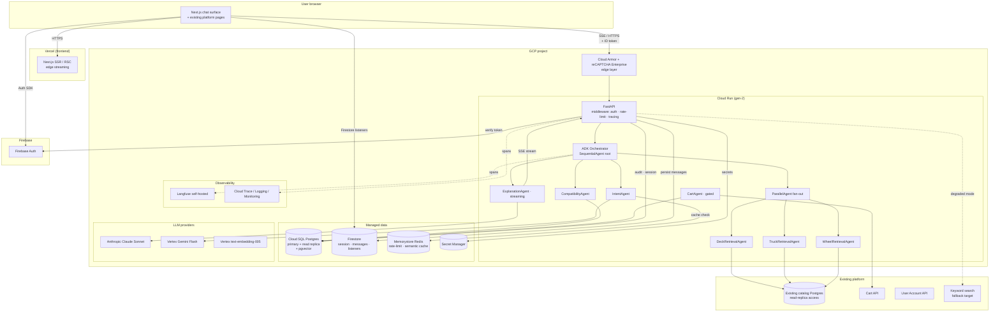

---
stepsCompleted:
  - step-01-init
  - step-02-context
  - step-03-starter
  - step-04-decisions
  - step-05-patterns
  - step-06-structure
  - step-07-validation
  - step-08-complete
status: complete
completedAt: 2026-05-06
lastStep: 8
inputDocuments:
  - _bmad-output/planning-artifacts/prd.md
  - _bmad-output/planning-artifacts/ux-design-specification.md
  - _bmad-output/planning-artifacts/product-brief-skate-ecommerce.md
documentCounts:
  prd: 1
  ux: 1
  briefs: 1
  research: 0
  projectDocs: 0
workflowType: 'architecture'
project_name: 'skate-ecommerce'
user_name: 'Jeremycamusvarela'
date: '2026-05-06'
projectContext: 'brownfield-extension'
architectureConstraints:
  cloud: 'GCP (Firebase-integration-driven); managed services preferred'
  backend: 'Python · FastAPI + ADK · stateless containers'
  database: 'PostgreSQL via Cloud SQL; transactional separation from session/realtime'
  identity: 'Firebase Auth (system of record)'
  realtime: 'Firestore for session, messages, streaming coordination'
  frontend: 'Next.js App Router · SSR + streaming · hybrid chat+product'
  ai: 'ADK multi-agent (committed); per-agent observability + eval + cost tracking'
  migrations: 'Alembic mandatory · idempotent · reversible · CI-validated · auto-applied on deploy'
  deployment: 'Docker containers · horizontal scaling for 2k peak'
  observabilityCandidate: 'Langfuse self-hosted on GCP OR GCP-native (Cloud Trace + Logging + Monitoring) — to decide'
  security: 'Firebase token validation · anonymous rate limiting · prompt-injection defenses'
resolvedOpenQuestions:
  - 'Identity SoR: Firebase Auth (committed in architecture intake)'
outstandingDecisions:
  - 'Cloud Run vs GKE for stateless Python service'
  - 'LLM provider routing: Anthropic direct vs Vertex AI vs Gemini-primary + fallback'
  - 'Observability vendor: Langfuse vs GCP-native'
  - 'Cart API protocol (existing platform): API contract vs adapter layer'
  - 'Catalog access protocol: direct Postgres read vs internal API'
---

# Architecture Decision Document

_This document builds collaboratively through step-by-step discovery. Sections are appended as we work through each architectural decision together._

## Project Context Analysis

### Requirements Overview

**Functional requirements (PRD: 50 FRs across 9 capability clusters).**

The architecture must support nine distinct capability areas, each with its own architectural footprint:

| Cluster | FRs | Architectural footprint |
|---|---|---|
| Conversational discovery | FR1–7 | Frontend chat surface, ChatInput component, IntentAgent, multi-turn session state |
| Recommendation reasoning & explanation | FR8–15 | IntentAgent → ParallelAgent retrieval → ExplanationAgent (streamed); SSE delivery; grounding enforcement |
| Compatibility validation | FR16–20 | Deterministic Compatibility Layer service (Postgres-backed rules + thin service); CompatibilityAgent in the topology |
| Cart construction | FR21–26 | Cart-add API integration, idempotency-key handling, all-or-nothing semantics, mutation allow-list at gateway |
| Identity & session | FR27–32 | Firebase Auth verification, Firestore session/message persistence, cross-device hydration, anonymous rate/cost caps |
| AI operations & observability | FR33–38 | Per-trace telemetry pipeline, eval harness CI integration, per-agent metrics, loop/cost gateway controls |
| Compatibility rule authoring | FR39–42 | Repository-based rule workflow, per-rule firing telemetry, rule schema as code |
| Privacy & data control | FR43–47 | AI disclosure UI, opt-out toggles, retention jobs, PII-stripped analytics, data-residency pinning |
| Operational resilience | FR48–50 | LLM circuit-breaker, degraded-mode fallback to keyword search, architectural non-coupling from existing platform |

**Non-functional requirements (PRD: 42 NFRs across 7 quality-attribute categories).**

NFRs that materially drive architectural decisions:

- **Latency (NFR1–4).** P95 < 3s end-to-end; first user-visible token < 1s. Forces per-stage budget decomposition and an early-acknowledgement-stub pattern from a fast-model layer. SSE streaming as the delivery mechanism is non-negotiable.
- **Scalability (NFR14–19).** 50k DAU sustained, 2k peak concurrent. Drives stateless-handler architecture, horizontal-scale design, connection-pool sizing math, provider-rate-limit headroom requirement (≥2× peak).
- **Cost (NFR18).** P95 per-session cost ≤ $0.05 — hard constraint, gateway-enforced. Drives model-tiering + prompt-cache + semantic-cache architectural commitment.
- **Reliability (NFR20–25).** Architectural non-coupling: existing platform must hit ≥99.95% uptime regardless of assistant availability. Circuit-breaker, durable-write semantics, runbook discipline.
- **Security (NFR6–13).** Firebase ID-token verification at edge, mutation allow-list enforced at gateway, prompt-injection defenses, anonymous cost caps, audit logging, secret-management discipline.
- **AI quality (NFR37–42).** Eval harness as launch gate, per-agent eval slices, CI-blocking gates on prompt/model/topology changes. Drives a CI/CD pipeline that integrates the eval harness as a first-class step.
- **Accessibility (NFR26–30).** WCAG 2.2 AA across all surfaces. Drives Radix-primitives + axe-core CI choice already locked in by UX spec.

**UX architectural implications (UX spec).**

- **Streaming as a first-class architectural concern.** SSE token streaming + skeleton-then-stream UX requires backend support for token-level emission, frontend support for incremental render without layout thrash, and observability for streaming health (TTFT, throughput, drop rate).
- **Hybrid surface (chat + product browse).** Two interaction modalities on the same shell. Requires a single Next.js codebase that mounts the chat widget on existing platform pages and serves a dedicated `/chat` route. SSR on existing pages must not regress.
- **WCAG 2.2 AA.** Architectural impact is mostly in component selection (Radix, axe-core) and CI integration; minimal at the service-architecture layer.
- **Cross-device session continuity (auth users).** Firestore listeners deliver immediate hydration on second device. Session is the system-of-record only after streaming completes; SSE is the primary delivery channel mid-stream.
- **Mobile-first.** Drives mobile network throttling in load tests (NFR16) and chat-widget bundle-size budget (NFR5).

### Scale & Complexity Assessment

- **Project complexity:** **High.** Multi-agent orchestration with cost/latency/grounding constraints; brownfield integration across multiple platform surfaces; eval harness + observability as launch gates; hybrid web/AI/agent project type.
- **Primary technical domain:** Full-stack (Next.js frontend + Python service + LLM integration + AI orchestration layer + managed-data layer).
- **Estimated architectural components:** ~15 distinct services/components — Next.js frontend, FastAPI gateway, ADK agent orchestrator (with 6+ agents), Compatibility Layer service, observability collector, semantic cache, prompt cache, eval harness runner, rules-deploy pipeline, audit-log writer, Firestore-Firebase Auth integration, Cloud SQL Postgres + pgvector, Firestore, LLM provider, existing-platform integration adapters (catalog read, cart write, account read).
- **Scale targets:** 50k DAU sustained, 2k peak concurrent, ~3 prompts/session, P95 < 3s end-to-end, P95 < $0.05/session cost.

### Technical Constraints & Dependencies

**External dependencies:**

- **LLM provider** — primary + designated fallback (for circuit-breaker). Region-pinned to match data residency. Token-cost budget enforcement at the gateway layer. Provider rate-limit headroom ≥2× peak.
- **Firebase Auth** — identity system of record (committed in intake). ID-token verification via `firebase-admin` SDK at the Python service edge.
- **Firestore** — session/message persistence; realtime listeners for cross-device continuity. Not a token-streaming bus.
- **Existing-platform PostgreSQL** — read-only catalog access (protocol TBD: direct read vs. internal API). Brownfield extension; existing platform untouched.
- **Existing-platform cart API** — write surface with idempotency-key + all-or-nothing semantics required (adapter layer if API doesn't natively support).
- **Existing-platform user-account API** — read-only access for authenticated personalization; mediated by Firebase ID token.
- **Observability vendor** — narrowed to Langfuse self-hosted on GCP or GCP-native (Cloud Trace + Logging + Monitoring); decision pending.

**Platform / cloud constraints (intake-committed):**

- GCP as primary cloud, managed services preferred.
- Cloud SQL for PostgreSQL.
- Firestore as managed Firebase.
- Containerized Python services (Docker) — Cloud Run or GKE (decision pending).
- Alembic mandatory for schema migrations: idempotent, reversible, CI-validated, auto-applied on deploy, zero drift.
- Stateless handler architecture; horizontal scaling for 2k peak concurrent.

**Code-level constraints:**

- ADK multi-agent orchestration is the architectural commitment (no parallel single-agent design path).
- Pinned ADK version per deploy; LangGraph retained as a *future-decision option* via documented ADR, not as a designed-for fallback.
- Pydantic-based data contracts at the four agent seams (Intent, RetrievalCandidate, CompatibilityVerdict, Recommendation).
- TypeScript types on the frontend generated from JSON Schema export of Pydantic models.

### Cross-Cutting Concerns Identified

These ten concerns span multiple components and demand consistent architectural treatment:

1. **Authentication & identity flow** — Firebase ID-token verification at every authenticated endpoint; opaque session-ID pattern for anonymous; consistent token-extraction middleware across all gateway routes.
2. **Per-trace observability** — every conversational turn captures agent path, per-stage latency, total token cost, tool-call counts, hashed user identifier, cache hit/miss, compatibility-verdict counts. Single tracing pipeline across all components.
3. **Cost-bounded inference** — gateway-level token-budget caps, model tiering (fast for routing/extraction, reasoning for explanation), prompt-cache discipline (stable system+domain prefix), semantic-cache for head queries.
4. **Rate limiting & abuse mitigation** — multi-layer: per-anonymous-session token-bucket, per-IP rate limit, per-session cost cap, per-authenticated-user daily token cap, per-session iteration cap, per-session wall-clock cap, CAPTCHA escalation.
5. **Streaming delivery** — SSE direct from Python; Firestore as system-of-record only post-stream; durable-write-with-retry before client acknowledges turn complete; reconciliation job for orphans.
6. **Compatibility Layer integration** — every recommendation passes through the Compatibility Layer; no LLM-emitted SKU bypasses validation. Architectural enforcement via the agent topology (CompatibilityAgent is non-skippable).
7. **Data residency & privacy** — region-pinned LLM provider; 30-day conversation retention; PII-stripped analytics; raw queries not joined to user IDs; opt-out flow for authenticated users.
8. **CI/CD with eval-harness gates** — every prompt change, model upgrade, or agent topology change runs the eval harness; failures block merge. Alembic migration upgrade+downgrade tested in CI; container build + axe-core a11y + Lighthouse + bundle-size budget all gating.
9. **Schema management** — Alembic-only; idempotent + reversible; auto-applied on deploy; CI runs upgrade+downgrade test; zero drift between application version and schema.
10. **Failure-mode handling** — explicit per-dependency policy (LLM provider, Cloud SQL, Firestore, Firebase Auth, cart API, account API): timeout, retry, circuit-breaker behavior, user-visible degradation. The PRD requires the failure-mode matrix as a deliverable in this architecture document.

## Starter Template Evaluation

### Primary Technology Domain

This product spans two distinct technology domains, each requiring its own scaffolding:

1. **Frontend — Next.js 15 App Router** (web SPA + chat surface, hybrid commerce UX)
2. **Backend — Python + FastAPI + Google ADK** (multi-agent orchestration, AI application layer)

### Starter Options Considered

**Frontend candidates:**

- **`create-next-app` (canonical Next.js scaffold) + shadcn/ui CLI** — current Next.js 15 starter with App Router, TypeScript, Tailwind. shadcn/ui CLI installs the component primitives owned in-repo. **Selected.**
- **Vercel Commerce starter** — opinionated e-commerce Next.js starter with cart, checkout, PDP/PLP patterns. Rejected: we're a brownfield extension on an existing platform; we are *not* rebuilding checkout. The starter would force us to delete what we're not using and conflict with the existing-platform integration model.
- **T3 stack (Next.js + tRPC + Prisma)** — rejected. We're using FastAPI as the backend (not tRPC) and SQLAlchemy on Cloud SQL (not Prisma). The starter's value disappears if we strip the tRPC and Prisma layers.

**Backend candidates:**

- **Manual FastAPI + ADK + Alembic scaffolding (current best practices)** — full control, well-known pattern, matches the intake constraints exactly. **Selected.** No off-the-shelf template combines all three (ADK is too new for community-blessed full-stack starters that include Alembic).
- **`full-stack-fastapi-template` (community)** — too opinionated for our needs. Bundles a frontend (we have Next.js separately), Docker Compose with Traefik (we use Cloud Run), and uses migrations but not in the workflow we need. Rejected.
- **ADK CLI scaffolding (`adk init` if current)** — useful for the agents subtree but does not provide the FastAPI gateway, Alembic, or Cloud SQL integration. Worth using inside the manual scaffold for the agents layer. **Adopted as a sub-step.**

> **Note on ADK currency.** ADK ships fast and CLI semantics may have shifted since the PRD's research pass. The engineer scaffolding the project should verify current `adk` CLI behavior at scaffolding time and pin the ADK version once verified (PRD risk mitigation: ADK production-readiness caveats).

### Selected Starters

#### Frontend: `create-next-app` + shadcn/ui CLI

```bash
# Scaffold Next.js 15 with TypeScript + Tailwind + App Router
pnpm create next-app@latest skate-assistant-frontend \
  --typescript \
  --tailwind \
  --app \
  --src-dir \
  --import-alias "@/*"

cd skate-assistant-frontend

# Initialize shadcn/ui — copy components into the repo (no library lock-in)
pnpm dlx shadcn@latest init -d

# Install starter component set (matches Component Strategy in UX spec)
pnpm dlx shadcn@latest add \
  button input dialog sheet toast tabs tooltip popover \
  accordion skeleton scroll-area avatar badge card \
  switch select separator dropdown-menu

# Firebase Auth + Firestore client SDK
pnpm add firebase

# Testing & accessibility tooling
pnpm add -D @axe-core/playwright @playwright/test vitest \
  @testing-library/react @testing-library/jest-dom

# Geist fonts shipped via next/font/google — no install needed
```

#### Backend: Manual FastAPI + ADK + Alembic scaffolding (`uv` for deps)

```bash
mkdir skate-assistant-backend && cd skate-assistant-backend

# Initialize uv-managed Python project (Python 3.12)
uv init --python 3.12

# Core runtime deps
uv add \
  "fastapi[standard]" \
  google-adk \
  pydantic-settings \
  "sqlalchemy[asyncio]" \
  asyncpg \
  alembic \
  firebase-admin \
  google-cloud-firestore \
  google-cloud-secret-manager \
  opentelemetry-api opentelemetry-sdk opentelemetry-instrumentation-fastapi \
  pgvector \
  redis \
  httpx

# Dev deps
uv add --dev \
  pytest pytest-asyncio httpx ruff mypy \
  pre-commit alembic-utils

# Initialize Alembic in async mode (mandatory per intake)
uv run alembic init -t async migrations

# Scaffold project layout
mkdir -p app/{api/v1,agents,compatibility,models,services,observability} tests
touch app/main.py app/config.py app/dependencies.py
touch Dockerfile .dockerignore .env.example
```

### Architectural Decisions Provided by These Starters

#### Language & Runtime

- **Frontend:** TypeScript 5.x (strict mode), Node.js 22 LTS, pnpm package manager.
- **Backend:** Python 3.12, `uv` for dependency resolution and virtual-env management (faster than pip + venv, deterministic lockfile).

#### Styling Solution (Frontend)

- Tailwind CSS v4 (Tailwind's current major). Design tokens defined in `tailwind.config.ts` as CSS variables, matching the Visual Foundation spec.
- shadcn/ui components copied into `src/components/ui/` — owned by the team, no library churn.
- Geist Sans + Geist Mono via `next/font/google`.

#### Build Tooling

- **Frontend:** Next.js 15 with Turbopack for dev; standard Next.js production build (Vercel-grade RSC + streaming SSR).
- **Backend:** `uv build` for wheel packaging; multi-stage `Dockerfile` (build deps → slim runtime).

#### Testing Framework

- **Frontend:** Vitest for unit, Playwright for E2E + accessibility (axe-core integration).
- **Backend:** pytest + pytest-asyncio for unit/integration, httpx test client for FastAPI route tests.

#### Code Organization

**Backend project layout** (committed):

```
skate-assistant-backend/
├── app/
│   ├── main.py                 # FastAPI entrypoint
│   ├── config.py               # Pydantic Settings (env-driven config)
│   ├── dependencies.py         # FastAPI dependencies (auth, db, tracing)
│   ├── api/
│   │   └── v1/
│   │       ├── chat.py         # POST /v1/chat/turn (SSE), /chat/cart-add, /chat/session/*
│   │       └── ops.py          # /health, /readiness
│   ├── agents/
│   │   ├── intent.py           # IntentAgent
│   │   ├── retrieval.py        # DeckRetrievalAgent / TruckRetrievalAgent / WheelRetrievalAgent
│   │   ├── compatibility.py    # CompatibilityAgent (calls Compatibility Layer service)
│   │   ├── explanation.py      # ExplanationAgent (streaming reasoning)
│   │   ├── cart.py             # CartAgent (user-confirmation-gated)
│   │   └── orchestrator.py     # ADK SequentialAgent root + ParallelAgent fan-out
│   ├── compatibility/
│   │   ├── rules.py            # rule schema (Pydantic), versioned loaders
│   │   ├── service.py          # rule evaluation (accept / repair / reject)
│   │   └── metrics.py          # per-rule firing telemetry
│   ├── models/
│   │   ├── catalog.py          # SQLAlchemy read-only models (existing catalog)
│   │   ├── compatibility_rule.py
│   │   └── audit.py            # cart-mutation audit log
│   ├── services/
│   │   ├── cart_client.py      # existing cart API adapter (idempotency-aware)
│   │   ├── account_client.py   # existing user-account API adapter
│   │   ├── llm.py              # LLM provider client + circuit-breaker
│   │   ├── cache_prompt.py     # prompt cache (provider-native)
│   │   ├── cache_semantic.py   # semantic cache (Redis + embedding similarity)
│   │   ├── firestore.py        # Firestore session/message client
│   │   └── secrets.py          # GCP Secret Manager client
│   └── observability/
│       ├── tracing.py          # OpenTelemetry instrumentation
│       ├── metrics.py          # custom per-agent metrics
│       └── eval_export.py      # eval-harness telemetry export
├── migrations/                  # Alembic — versioned, reversible
│   ├── env.py                  # async-aware env (per intake)
│   └── versions/
├── tests/
│   ├── unit/
│   ├── integration/
│   └── eval/                   # Ground Truth Set + LLM-judge harness
├── Dockerfile                   # multi-stage; non-root user; signal-handling for graceful shutdown
├── .dockerignore
├── pyproject.toml
├── uv.lock
└── .env.example
```

**Frontend project layout** (committed):

```
skate-assistant-frontend/
├── src/
│   ├── app/
│   │   ├── layout.tsx          # global shell (chat input in header)
│   │   ├── page.tsx            # home
│   │   ├── chat/
│   │   │   └── page.tsx        # dedicated chat route
│   │   └── api/                # Next.js API routes ONLY for SSR helpers (token verify, session hydrate); NOT for AI calls
│   ├── components/
│   │   ├── ui/                 # shadcn/ui-derived primitives (owned in-repo)
│   │   ├── chat/               # ChatInput, ConversationStream, ClarificationTurn
│   │   ├── recommendation/     # RecommendationCard, SetupCardStack, WhyThisRationale, StickerTag, CompatibilityChip
│   │   ├── checkout/           # CartAddBottomSheet, CartAddInlineConfirmation
│   │   ├── degraded/           # DegradedModePanel
│   │   └── disclosure/         # AIDisclosurePill, ConfidenceBoundaryDisclosure
│   ├── lib/
│   │   ├── firebase.ts         # Firebase Auth + Firestore client init
│   │   ├── sse.ts              # SSE consumer + reconnection logic
│   │   ├── api.ts              # backend API client + token attach
│   │   └── streaming.ts        # useStreamingText hook
│   └── types/
│       └── api/                # types generated from backend JSON Schema
├── tests/
│   ├── e2e/                    # Playwright + axe-core
│   └── unit/                   # Vitest
├── public/
├── tailwind.config.ts
├── next.config.ts
├── package.json
└── pnpm-lock.yaml
```

#### Development Experience Features

- **Frontend:** Turbopack hot-reload, TypeScript strict mode, ESLint with custom touch-target rule, Prettier, Storybook (or Ladle) for component dev.
- **Backend:** `uvicorn --reload` for dev; ruff for linting + formatting; mypy in CI; pre-commit hooks for ruff + mypy + secret-scan.

### Rationale for Selection

This combination is selected because:

1. **It matches the intake constraints exactly.** Next.js App Router, Python + FastAPI + ADK, Alembic mandatory, GCP-native — every constraint is honored without bending the starter to fit.
2. **No off-the-shelf alternative covers all four** (ADK + FastAPI + Alembic + Cloud SQL). Manual scaffolding with `uv` is the current best practice for Python projects with bespoke composition needs in 2026.
3. **Component ownership philosophy preserved** — shadcn/ui's "copy not install" model aligns with the UX spec's design system commitment.
4. **Brownfield-extension-friendly** — neither starter assumes greenfield. The Next.js scaffold can mount as an embedded widget on the existing platform via a code-split chunk; the FastAPI backend is independent and stateless.
5. **Migration discipline preserved from day one** — Alembic initialized in async mode at project bootstrap, not retrofitted later.

### Initialization as the First Implementation Story

Project bootstrap (running both starter commands above + initial Cloud SQL provisioning + Alembic initial migration + base CI pipeline) should be **the first implementation story**, completed before any feature work. This sets the tooling baseline and lets every subsequent story build on a verified, eval-gated, accessibility-tested foundation.

## Core Architectural Decisions

### Decision Priority Analysis

**Critical decisions (block implementation):** all the ones below in *Data*, *Auth & Security*, *API*, *Frontend*, and *Infrastructure*. Each is committed with a documented rationale.

**Important decisions (shape architecture):** intra-agent retrieval ordering, prompt-cache key design, semantic-cache eviction policy — addressed in Step 5 (Implementation Patterns).

**Deferred decisions (post-MVP):** image-search architecture, voice-input pipeline, multi-language deployment topology — out of v1 scope per PRD.

**Already decided in prior steps and intake (not re-deciding):**

| Decision | Source | Value |
|---|---|---|
| Cloud provider | Intake | GCP |
| Identity SoR | Intake | Firebase Auth |
| Backend framework | Intake | Python · FastAPI · ADK |
| Frontend framework | Intake / UX | Next.js 15 App Router |
| Database | Intake | PostgreSQL via Cloud SQL |
| Realtime / session | Intake | Firestore |
| Migrations tooling | Intake | Alembic (mandatory, async mode) |
| Multi-agent commitment | Intake | ADK multi-agent (no parallel single-agent path) |
| Container runtime | Intake | Docker; horizontal scaling for 2k peak |
| Design system foundation | UX | Tailwind + Radix + shadcn/ui |
| Project structure | Step 3 starter | Next.js + FastAPI layouts above |

### Data Architecture

- **Primary datastore:** **Cloud SQL for PostgreSQL 16** (current stable major). Regional HA configuration with automatic failover. Private IP via VPC peering. Read-replica for assistant catalog access.
- **Catalog access protocol:** **direct read on a Cloud SQL read replica** with a dedicated `assistant_read_only` role. SQL-level access is required for the parallel attribute-filter pattern (faster + more accurate than going through an internal API on the latency-critical path). The read replica isolates assistant query load from the existing platform's transactional load. *Tradeoff:* tighter coupling to the existing schema. *Mitigation:* an assistant-owned `app/models/catalog.py` defines a read-only SQLAlchemy view of the existing tables, versioned with our migrations; schema changes are a coordination point with the existing platform team. **Resolves PRD Open Question.**
- **Compatibility Layer storage:** Postgres tables (`compatibility_rule`, `compatibility_rule_version`, `compatibility_rule_metric`). Each rule has explicit `version`, `owner`, `effective_at`, `superseded_by`. Loader is Pydantic-typed; evaluation is deterministic Python.
- **Audit log:** Postgres table `cart_mutation_audit` with `hashed_user_id` (HMAC-SHA256 with rotating salt), session ID, timestamp, SKU set, recommendation source, idempotency key. **Retention 90 days** (NFR11).
- **Conversation / session:** **Firestore** for message persistence and session state. Realtime listeners deliver cross-device hydration. Final assistant messages written after streaming completes. Firestore is **not** a token-streaming bus.
- **Unstructured content (RAG):** **pgvector** extension on Cloud SQL Postgres for embeddings of reviews, technique guides. Vector search is **not** on the attribute-query critical path.
- **Embeddings model:** **Vertex AI `text-embedding-005`** (current). Used for both unstructured RAG and semantic-cache key generation. GCP-native, low-latency from Cloud Run.
- **Caching layers (mandatory per PRD + intake):**
  - **Prompt cache:** Anthropic's native prompt-caching (`cache_control` on system + domain prefix). 5-minute TTL; session pacing keeps the prefix warm.
  - **Semantic cache:** **Memorystore for Redis (Standard tier, HA, 5 GB initial)** — fronts IntentAgent extractions on head queries. Cache key derived from normalized intent JSON. Quality gate (similarity threshold + periodic revalidation) before reuse.
- **Migrations:** Alembic in async mode, all migrations idempotent + reversible. CI gate runs `alembic upgrade head` then `alembic downgrade -1` then `upgrade head` again on every PR. Migrations auto-applied on deploy via a Cloud Run pre-deploy job (separate Cloud Run *Job* resource, runs to completion before the new revision receives traffic). **Zero schema drift** — application version and schema version are always paired (enforced by `alembic_version` table check at app startup).
- **Connection pool sizing:** Cloud SQL connection limit on `db-custom-4-15360` ≈ 400 concurrent connections. With 2k peak concurrent users × ~3 prompts × parallel-fanout-of-3 → bursty short-lived connections. Use **Cloud SQL Connector via `asyncpg`** with per-instance pool of 20 connections; with min-2 / max-50 Cloud Run instances = headroom of 1000 connections (within 400-conn ceiling at typical scale, with Cloud SQL Connector pooling). Pgbouncer not needed at v1 scale; revisit at Phase 2 growth.

### Authentication & Security

- **Authentication:** Firebase Auth ID tokens verified at the FastAPI service edge via `firebase-admin` SDK middleware. Token verification cached for 5 minutes per token (Firebase Auth public-key rotation respected via JWKS).
- **Anonymous sessions:** server-issued UUID v4, signed in an HS256 JWT with our own secret (rotated quarterly via Secret Manager). Expiry 1 hour from last activity. Carried in a httpOnly + secure + sameSite=lax cookie.
- **Authorization pattern:** bearer-token middleware populates request context with `user_id` (authenticated) or `anon_session_id` (anonymous). Endpoint-level FastAPI `Depends(require_auth)` for routes that require authentication (cross-device resume, opt-out toggle, history).
- **Rate limiting:** **layered**. (1) **Cloud Armor** edge layer for IP-based DDoS / bot mitigation. (2) **In-process token-bucket** at the FastAPI middleware backed by Memorystore Redis (same Redis used for semantic cache, separate keyspace) with limits per anonymous session ID, per IP, per authenticated user (daily token cap). (3) **Per-session iteration cap, token cap, wall-clock cap** enforced inside the orchestrator before any LLM call.
- **CAPTCHA:** **reCAPTCHA Enterprise** (GCP-native) with adaptive scoring. Triggered only on suspicious patterns (high anon RPS from same IP, unusual prompt length distribution, bot-network signatures).
- **Secret management:** **GCP Secret Manager** for all secrets — LLM provider keys, Firebase admin credentials, JWT signing secret, internal service tokens, observability vendor keys. Rotation on schedule (quarterly for non-LLM secrets; LLM provider keys rotated per provider's recommendation). CI/CD reads via dedicated service account with `roles/secretmanager.secretAccessor`.
- **Encryption:** Cloud SQL at-rest (default Google-managed keys; CMEK is post-v1 if compliance demands). TLS 1.3 in transit. Firestore at-rest (default).
- **Audit log:** `hashed_user_id` (HMAC-SHA256, salt rotated quarterly, dual-salt window for re-identification during transition). 90-day retention (NFR11). Immutable — no UPDATE/DELETE allowed via DB privileges.
- **API security:**
  - HTTPS only (Cloud Run terminates TLS).
  - CORS: explicit allowlist of frontend origins (production domain + staging + localhost-dev).
  - CSP: strict; no `unsafe-inline`; SSE endpoint and Geist font CDN whitelisted; report-only mode for first week post-launch, enforce after.
  - HSTS: max-age 1 year, include subdomains, preload.
  - Mutation allow-list at gateway: middleware blocks any tool-call request from agent code that targets endpoints outside `cart-add` (architectural enforcement of FR25, FR26, NFR9).
- **Prompt-injection defense:** all retrieved content from RAG (reviews, guides) tagged as untrusted in a prompt segment; structured-output schema enforcement on every LLM response (Pydantic validation as a hard fail); pre-launch red-team pen-test of the tool surface (NFR10, launch-blocking).

### API & Communication Patterns

- **API style:** **REST + SSE for streaming.** JSON request/response. SSE event-stream for the chat-turn endpoint with named event types (`token`, `tool_call`, `recommendation`, `clarification`, `done`, `error`).
- **API documentation:** **OpenAPI 3.1** auto-generated by FastAPI; **Scalar** UI for browsing (replaces Swagger UI; cleaner, more modern).
- **Versioning:** path-versioned (`/v1/...`); SSE event-schema versioned independently in payload; breaking changes ship under `/v2/` with overlap.
- **Error handling:** structured error envelope on every error response (`{ code, message, request_id, retry_after?, details? }`). HTTP status codes per the PRD project-type spec (400/401/403/429/502/503/504). Circuit-breaker decisions surface as `503` with documented reason code.
- **Rate limiting:** see Auth & Security section.
- **Service-to-service communication:** minimal in v1 (single backend service). Phase 2 split (e.g., separate Compatibility Layer service): HTTPS + JSON internally; service-account auth via GCP IAM; mTLS optional via Cloud Run private-service connectivity.
- **Frontend ↔ backend types:** JSON Schema exported from Pydantic models; TypeScript types generated via `json-schema-to-typescript` and committed to the frontend repo (not generated at runtime). One source of truth.
- **Existing-platform integration adapters:**
  - **Catalog read** — direct Postgres (above).
  - **Cart write** — thin Python adapter (`app/services/cart_client.py`) that wraps the existing platform's cart endpoints. Idempotency-key-aware; setup-add uses transactional client-side composition with rollback (PRD Assumption #4 — adapter is in v1 scope). **Resolves PRD Open Question.**
  - **User account read** — HTTPS internal API call mediated by the user's Firebase ID token (existing platform validates the token against Firebase Auth same as we do). If existing platform doesn't yet accept Firebase ID tokens, an adapter at the existing-platform side is a coordination requirement.

### Frontend Architecture

- **State management:** **Zustand** for cross-route client state (session ID, cart preview state, theme), **TanStack Query (React Query)** for server state and caching, **React Context** for theme provider. **No Redux** — overkill for this scale.
- **Routing:** Next.js App Router (committed). Existing platform pages remain SSR; chat widget mounts client-side and is code-split.
- **Streaming:** Next.js streaming SSR for SEO-relevant pages; client components for the chat surface; SSE consumer in `lib/sse.ts` with reconnection logic and token buffering.
- **Performance optimization:**
  - Chat widget code-split via dynamic import (NFR5; initial bundle ≤ 50 KB gzipped).
  - Image optimization via Next.js `<Image>` (AVIF/WebP/JPEG).
  - Bundle-size budget enforced in CI.
  - Cloud CDN in front of Vercel (or in front of Cloud Run if frontend runs on Cloud Run).
- **Client-side data fetching:** TanStack Query with stale-while-revalidate for product detail and session history; SSE direct for streaming.
- **Error boundaries:** per-route boundaries; granular boundary around the chat widget — if the widget crashes, the existing platform pages render unaffected and the boundary surfaces the `DegradedModePanel`.

### Infrastructure & Deployment

- **Backend hosting:** **Cloud Run (gen-2 execution environment).** Decision made over GKE because: (a) stateless services map cleanly; (b) auto-scaling from min-2 instances to max-50 handles 2k peak concurrent without cluster management; (c) gen-2 supports up to 60-minute request timeouts (SSE long-lived connections fit comfortably); (d) Cloud SQL private-IP integration via Cloud SQL Connector is native; (e) operational overhead dramatically lower than running and maintaining GKE. **Resolves outstanding decision.**
- **Frontend hosting:** **Vercel** for Next.js — canonical deployment target, best-in-class edge SSR + streaming. Backend remains GCP-native; cross-cloud is fine (HTTPS-only).
- **CI/CD pipeline:** **GitHub Actions.** Stage gates:
  1. Lint (ruff + ESLint)
  2. Typecheck (mypy + tsc)
  3. Unit tests (pytest + vitest)
  4. Integration tests (httpx + Playwright)
  5. **Eval harness** (LLM-judge over Ground Truth Set, lower-CI-bound ≥ 85%) — gating for prompt/model/agent changes
  6. **Alembic upgrade + downgrade + upgrade test** — gating for migration changes
  7. **axe-core a11y** + Lighthouse + bundle-size budget — gating for frontend
  8. Container build + vulnerability scan
  9. Deploy to staging → smoke test → load test (peak-concurrent simulation)
  10. Manual promotion to production (or auto-promote with a 10% canary for 30 min)
- **Environment configuration:** Pydantic Settings; Secret Manager for secrets; env vars for non-secret config (region, log level, feature flags).
- **LLM provider routing:**
  - **Reasoning model (ExplanationAgent):** **Anthropic Claude Sonnet via Anthropic API**. Top-tier quality at our latency budget; native prompt caching with explicit `cache_control`.
  - **Fast/small model (IntentAgent + early-acknowledgement stub):** **Vertex AI Gemini Flash**. GCP-native (lower latency from Cloud Run, no egress cost, service-account auth). Sub-500ms TTFT typical.
  - **Architectural fallback:** *not* another LLM — keyword search via existing platform (per PRD circuit-breaker). Multi-LLM use is for *latency optimization*, not *failure resilience*.
  - **Decision is reversible.** If load tests show Anthropic Claude Haiku is faster than Gemini Flash from Cloud Run, swap is a config change at the LLM provider abstraction (`app/services/llm.py`).
- **Observability vendor:** **Langfuse self-hosted on Cloud Run** + **OpenTelemetry dual-emit to Cloud Trace + Cloud Monitoring**. Decision made over GCP-native-only because: (a) Langfuse is purpose-built for LLM traces — prompt/completion, token cost, eval feedback are first-class; (b) Python SDK integrates cleanly with FastAPI + ADK; (c) self-hosted on GCP keeps trace data in our project (data-residency aligned); (d) OpenTelemetry dual-emit means we get Cloud Trace's distributed-trace UI for non-LLM spans while Langfuse owns the LLM-specific surfaces. **Resolves PRD Open Question.**
- **Scaling strategy (Cloud Run):**
  - Min instances: **2** (avoid cold starts on first user request)
  - Max instances: **50** (headroom for 2k peak concurrent at concurrency-per-instance of 40)
  - Concurrency per instance: **40** (LLM + DB calls are I/O-bound; per-instance throughput limited by CPU during agent orchestration, not RPS)
  - CPU: 2 vCPU; memory: 4 GiB
- **Cloud SQL sizing:** `db-custom-4-15360` (4 vCPU, 15 GB RAM) for primary; same for read replica. Vertical scaling path documented; horizontal sharding deferred to Phase 3+.
- **Memorystore Redis:** Standard tier (HA), 5 GB initial. Used by both rate-limiter and semantic cache (separate keyspaces).
- **Disaster recovery:**
  - Cloud SQL automated backups, 35-day retention; PITR enabled.
  - Firestore daily exports to Cloud Storage; 90-day retention.
  - Infra-as-code via **Terraform**. Reconstructibility from Terraform state + code is the baseline; runbooks document manual recovery for edge cases.

### Decision Impact Analysis

**Implementation sequence (architecturally required ordering):**

1. **GCP project + IAM + VPC + Secret Manager** — foundation for everything below.
2. **Cloud SQL primary + read replica + initial Alembic migration** — schema and connection plumbing must exist before any service runs.
3. **Cloud Run service skeleton (FastAPI hello-world) + Cloud SQL Connector** — proves the connection chain.
4. **Firebase Auth integration + token-verify middleware** — auth must exist before any authenticated route.
5. **Frontend scaffold (Next.js + shadcn/ui) + Firebase client SDK** — frontend bootstrap.
6. **Compatibility Layer service + initial rule schema + first 5 rules** — load-bearing for the differentiator; first agent (IntentAgent) needs it to ship.
7. **ADK orchestrator + IntentAgent + ExplanationAgent (single setup recommendation flow)** — minimum vertical slice.
8. **Eval harness scaffolding + Ground Truth Set seed** — eval gate must exist before further agent expansion.
9. **Memorystore Redis + semantic cache + rate-limiter** — required for cost cap (NFR18).
10. **Observability: Langfuse + OpenTelemetry + dashboards** — required at launch (NFR36).
11. **Existing-platform adapters (cart, account, catalog read)** — required for end-to-end flow.
12. **DegradedModePanel + circuit-breaker** — required for graceful degradation (NFR22).

**Cross-component dependencies:**

- **LLM provider × Secret Manager × CI/CD:** secrets must be provisioned in Secret Manager and accessible to Cloud Run service account before any LLM call works in any environment.
- **Cloud Run × Cloud SQL × VPC:** private-IP connectivity requires Cloud SQL Connector + VPC connector; Terraform must provision both before backend deploys.
- **Eval harness × ADK orchestrator × Langfuse:** eval results emit to Langfuse for dashboard visibility; both must exist before CI gate is meaningful.
- **Compatibility Layer × Catalog read × Audit log:** all live in the same Postgres instance; Alembic migrations must establish all three before the first agent runs.
- **Firebase Auth × Firestore × Frontend SDK:** auth context propagates from frontend through ID token to backend through Firestore security rules; misconfiguration in any one breaks the chain.

## Implementation Patterns & Consistency Rules

These patterns are non-negotiable defaults for every AI implementation agent. The goal is to eliminate decision space wherever divergence between agents would cause integration bugs or visual/behavioral inconsistency.

### Naming Patterns

#### Database (PostgreSQL)

| What | Convention | Example |
|---|---|---|
| Tables | `snake_case`, **plural** | `users`, `cart_mutations`, `compatibility_rules` |
| Columns | `snake_case` | `user_id`, `created_at`, `is_active` |
| Foreign keys | `<referenced_singular>_id` | `user_id`, `compatibility_rule_id` |
| Indexes | `idx_<table>_<cols>` | `idx_cart_mutations_session_id` |
| Unique constraints | `uq_<table>_<cols>` | `uq_compatibility_rules_name_version` |
| Check constraints | `chk_<table>_<rule>` | `chk_compatibility_rules_version_positive` |
| Alembic migration files | `<timestamp>_<descriptive_slug>.py` | `2026_05_06_1430_add_compatibility_rules.py` |

#### REST API

| What | Convention | Example |
|---|---|---|
| Endpoints | plural nouns; kebab-case for multi-word | `/v1/chat/turn`, `/v1/chat/cart-add` |
| Path parameters | `{snake_case}` (FastAPI default) | `/v1/chat/session/{session_id}` |
| Query parameters | `snake_case` | `?since_timestamp=...` |
| Headers | RFC 6648 (no `X-` prefix on new headers) | `Idempotency-Key`, `Authorization`, `Last-Event-ID` |
| HTTP status codes | per REST conventions; machine-readable reason code in body | `503` + `{ "code": "LLM_DEGRADED" }` |

**API versioning policy.**

- All endpoints versioned via path: `/v1/...` (no header- or query-based versioning).
- Breaking changes require a new path version (`/v2/...`).
- Backward compatibility maintained **within** a version — non-breaking field additions allowed; field removals, renames, and type changes are breaking.
- **Deprecation policy:** old versions remain active for **at least one release cycle** after the successor ships. During overlap, both versions are documented; deprecation notices in OpenAPI; client metrics track usage of deprecated routes.

#### Python (backend)

| What | Convention | Example |
|---|---|---|
| Modules | `snake_case` | `cart_client.py`, `intent_agent.py` |
| Classes | `PascalCase` | `IntentAgent`, `CompatibilityVerdict` |
| Functions | `snake_case` | `extract_intent`, `validate_setup` |
| Variables | `snake_case` | `user_id`, `cart_total` |
| Constants | `SCREAMING_SNAKE_CASE` | `MAX_TOKENS_PER_TURN` |
| Pydantic models | `PascalCase`; no `Model` / `Schema` suffix unless disambiguating | `Recommendation`, `UserCreate`, `UserResponse` |

**Schema versioning (Pydantic).**

- All externally exposed schemas (request bodies, response payloads, SSE event payloads) are backward-compatible **within** an API version. Adding optional fields is non-breaking; removing fields, renaming fields, or changing field types is breaking.
- Breaking schema changes require **one of**:
  1. A new API path version (`/v2/...`), with the old schema living on under `/v1/...`.
  2. An explicit versioned schema class (`RecommendationV2`) used alongside `Recommendation` under the same path version, with the new field selected via opt-in (e.g., `Accept-Version` header or a query param) — only used for surgical evolution within a long-lived major version.
- Internal Pydantic models (agent-to-agent, DB-to-app) are not versioned but follow the same backward-compatible-within-a-major principle.

#### TypeScript (frontend)

| What | Convention | Example |
|---|---|---|
| Component files | `PascalCase.tsx` | `SetupCardStack.tsx` |
| shadcn primitives in `components/ui/` | lowercase, per shadcn-cli convention (carve-out) | `button.tsx`, `input.tsx`, `dialog.tsx` |
| Hook files | `kebab-case.ts` with `use-` prefix | `use-streaming-text.ts` |
| Utility files | `kebab-case.ts` | `sse-consumer.ts` |
| Components | `PascalCase` | `<SetupCardStack />` |
| Hooks | `camelCase` with `use` prefix | `useStreamingText` |
| Functions | `camelCase` | `formatPrice`, `extractIntent` |
| Types / interfaces | `PascalCase` | `Recommendation`, `Intent` |
| Constants | `SCREAMING_SNAKE_CASE` | `MAX_RECOMMENDATIONS_PER_TURN` |

### Structure Patterns

#### Project organization

The full project layouts are committed in Step 3 (Starter Template Evaluation). Do not deviate.

- **Backend tests:** `tests/` directory mirrors `app/` structure; test files prefixed `test_` (pytest convention).
- **Frontend tests:** `tests/unit/` for Vitest; `tests/e2e/` for Playwright; component stories co-located as `*.stories.tsx`.
- **Eval harness:** `tests/eval/` containing the Ground Truth Set (stratified YAML / JSON) and the LLM-judge runner.
- **Configuration:** backend uses `app/config.py` (Pydantic Settings, env-driven); frontend uses `next.config.ts` + `tailwind.config.ts`. `.env.example` files are committed; real `.env*` files are git-ignored.
- **Agents:** every agent lives in `app/agents/`. No agent logic outside this directory.
- **External-service clients:** every external-service client lives in `app/services/<service>_client.py`. No HTTP / SDK calls outside this directory.

### Format Patterns

#### API responses

- **Success responses:** direct payload — no `{ data: ..., error: ... }` envelope. Cleaner, more idiomatic, and aligns with FastAPI defaults.
- **Error responses:** structured envelope:
  ```json
  {
    "code": "RATE_LIMITED",
    "message": "Too many requests",
    "request_id": "uuid",
    "retry_after": 60,
    "details": { "limit_kind": "anonymous_session" }
  }
  ```
- **Dates:** ISO 8601 strings in JSON (`"2026-05-06T14:30:00Z"`). Never numeric timestamps.
- **Pagination:** cursor-based for any time-ordered list; offset-based forbidden for chat history (Firestore listeners handle this); not used in v1 chat surface.

#### JSON field naming

**`snake_case` in JSON, TypeScript types match server `snake_case` literally** — no automatic camelization at the boundary. The TypeScript types are generated from Pydantic JSON Schema and committed to the frontend repo; this single source of truth eliminates a class of bugs.

#### Data formats

- **Booleans:** `true` / `false` only. Never `0` / `1`, never `"yes"` / `"no"`.
- **Null handling:** explicit `null` for missing optional fields. Never empty string or `0` as a sentinel. Pydantic uses `Optional[X]` consistently; TypeScript uses `T | null` (not `T | undefined`) for fields that are nullable in JSON.
- **Empty arrays:** `[]`, never `null`. Empty objects: `{}`, never `null`. (Distinguishes "no items" from "field omitted".)

### Communication Patterns

#### SSE event types and delivery guarantees (the chat-turn endpoint)

The complete enumerated set of event types:

| Event name | Payload | When emitted |
|---|---|---|
| `token` | `{ "text": "..." }` | Token-by-token streaming of explainer text |
| `recommendation` | full `Recommendation` Pydantic object | When a recommendation card is ready (one event per card) |
| `clarification` | `{ "question": "...", "quick_replies": [...] }` | When intent underspecified |
| `compatibility_verdict` | `{ "candidate_sku": "...", "verdict": "accept|repair|reject", "rule_refs": [...] }` | Per-candidate validation result (debug-only in production; logged not displayed) |
| `tool_call` | `{ "tool": "...", "args": {...} }` | Debug-only (dev/staging; suppressed in production via env flag) |
| `done` | `{ "turn_id": "..." }` | Turn complete; client may close stream |
| `error` | `{ "code": "...", "message": "...", "retry": true \| false }` | Terminal error |

**SSE delivery guarantees (hard contract).**

- **Every event carries:**
  - `event_id` — monotonically increasing **per turn** (resets at the start of a new turn). UUID v7 (time-ordered) or integer; integer recommended for compactness and ordering clarity.
  - `turn_id` — UUID v4, stable across all events within a turn.
  - SSE-native `id:` field set to `event_id` so the browser delivers it as `Last-Event-ID` on reconnection.
- **Ordering:** events are delivered in `event_id` order. The server must not emit out-of-order; the client may safely assume order.
- **Idempotent client consumption:** the client deduplicates by `event_id`. Re-receiving an `event_id` it has already processed is a no-op. (This makes server retries on the same `event_id` safe.)
- **Resume via `Last-Event-ID`:** on reconnection, client sends `Last-Event-ID: <last_processed_event_id>`. Server resumes streaming from `event_id + 1` for that `turn_id` (turn state held in Firestore + ephemeral memory; turns abandoned after 5 minutes drop their resume window).
- **Final-event guarantee:** every turn ends with exactly one `done` or `error` event. Client treats either as turn-complete.
- **Heartbeat:** server emits a comment-line keepalive (`: heartbeat\n\n`) every 15 seconds during long pauses to prevent intermediate proxies from idle-closing the connection.

#### Internal event / log names

`dot.notation`, action-shaped: `agent.intent.extracted`, `cart.add.confirmed`, `compatibility.rule.fired`, `llm.provider.timeout`. Used as keys for log events and metric names.

#### Frontend state management

- **Zustand stores:** one per concern; never one mega-store. Examples: `useChatStore`, `useThemeStore`, `useAuthStore`, `useCartPreviewStore`.
- **Actions:** verb-noun. `addMessage`, `setTheme`, `signIn`, `clearSession`.
- **Selectors:** explicit functions exported from the store module; never direct property access in components (forces memoization).
- **No prop drilling > 2 levels:** if a value passes through more than 2 components, it belongs in a store or context.

### Process Patterns

#### Error handling

- **Backend:** FastAPI exception handlers map domain exceptions to structured error responses (above). Never return raw stack traces. Domain exceptions are typed (`CartAdapterError`, `LLMProviderTimeout`, `CompatibilityRuleViolation`).
- **Frontend:** React error boundaries per major route. The chat widget has its own boundary that surfaces the `DegradedModePanel` on crash. Toast for transient (≥ 4 s, dismissible). Inline retry for cart-add.
- **Logging:** structured JSON logs, one per request, with `request_id`, `hashed_user_id`, `status`, `duration_ms`, `agent_path`. No `console.log` / `print` in production code paths.

#### Loading states

- **Naming:** TanStack Query conventions — `isLoading`, `isPending`, `isFetching`, `isError`, `isStreaming`. **No** custom `loading` boolean; reuse the framework names.
- **UI:** skeleton-then-stream pattern (UX commitment). **Never spinners.** Skeleton matches final layout exactly (3 muted rectangles for rationale, gray block at correct aspect ratio for hero image).
- **Granularity:** per-component, not global. Only exception: the initial Firebase Auth state-check on app mount, which uses a global splash for ≤ 1 s.

#### Retry implementation

- **Idempotency:** every cart-add carries an `Idempotency-Key` header (UUID v4); backend honors via `app/services/cart_client.py`.
- **Backoff:** exponential with jitter, max 3 retries, **only** on retriable errors (5xx with retry-after, 429 with retry-after, transient network failures). 4xx errors never retried.
- **SSE reconnection:** client reconnects with `Last-Event-ID` header (above); server resumes from last confirmed event. Mid-stream interruptions show partial text + inline retry affordance.

**Rate limiting (committed contract).**

| Tier | Identifier | Limit | Scope |
|---|---|---|---|
| **Anonymous** | session-ID + IP | **stricter token-bucket** per anonymous session — concrete numbers tuned at load test, e.g. 30 chat turns / hour, 10 cart mutations / hour, $0.10 cost cap / day | Per anonymous session |
| **Authenticated** | `user_id` | **higher limits** — e.g. 300 chat turns / day, 100 cart mutations / day, $5 cost cap / day | Per authenticated user |
| **All tiers** | per-IP | per-IP rate limit independent of session/user (DDoS / bot mitigation) | Cloud Armor edge |

- **Limits apply to both chat turns AND cart mutations.** Cart mutations have their own bucket (don't share with chat turns) — abuse on cart-add must not consume the chat-turn budget.
- **Exceeding any limit returns `429`** with `retry_after` (seconds) in both the response body and the standard `Retry-After` header.
- **Per-session controls inside the orchestrator** (iteration cap, token cap, wall-clock cap) operate independently of the gateway rate limiter; they cap individual turns, not turn frequency.
- **CAPTCHA escalation** triggers when a single anonymous session ID hits the rate limit ≥ 3 times in an hour or matches bot-signature heuristics.

#### Validation

- **Backend:** Pydantic v2 at every API boundary. Failures return `400` with structured errors. No defensive `try/except` around Pydantic — let it raise, the global handler catches.
- **Frontend:** Zod for client-side validation; same shape as Pydantic models (types generated from JSON Schema include validators).
- **Database:** every column NOT NULL or explicitly nullable; CHECK constraints for invariants (e.g., `chk_compatibility_rules_version_positive`). Don't rely on application code to enforce DB invariants.

#### Authentication flow

- **Frontend:** Firebase Auth client SDK → ID token → attach to `Authorization: Bearer <id_token>` on every authenticated request. Token refresh handled by Firebase client SDK automatically.
- **Backend:** `firebase-admin` middleware verifies on every protected route; populates `request.state.user_id` (authenticated) or `request.state.anon_session_id` (anonymous). Token verification cached for 5 minutes per token via JWKS.
- **Expired token:** backend returns `401` with `{ "code": "TOKEN_EXPIRED" }`; frontend triggers Firebase SDK refresh and retries once.

### Enforcement Guidelines

**All AI implementation agents MUST:**

1. **Use Pydantic models from `app/schemas/` as the source of truth** for any data crossing a boundary. Never invent ad-hoc dicts at boundaries.
2. **Reference design tokens from `tailwind.config.ts`** — never raw color, spacing, or font-size values in component code.
3. **Write Alembic migrations for any schema change** — no raw SQL in `app/` code, no schema changes outside migrations.
4. **Use the `useStreamingText` hook** for any streamed-text region — never custom per-component streaming logic.
5. **Use `app/services/cart_client.py` for all cart writes** — idempotency-key-aware; never bypass the adapter.
6. **Add OpenTelemetry span instrumentation** to every new agent or external-service call — never silent calls.
7. **Add a Storybook story for every new custom component** — required for axe-core CI; failures block merge.
8. **Generate TypeScript types from JSON Schema export of Pydantic models** — never hand-write TS types for backend payloads.
9. **Honor `prefers-reduced-motion`** — every animation, transition, or streaming visualization checks the media query.
10. **Treat retrieved RAG content as untrusted** — never include unsanitized RAG text in a system prompt; tag it as `<untrusted_source>`.
11. **Emit `event_id` and `turn_id` on every SSE event.** No event without both.
12. **Versioned schemas evolve under the policy above** — never change a public schema in place; bump version or use an explicit `RecommendationV2`.
13. **Rate-limit decisions go through the gateway middleware** — never implement bespoke per-route rate limiting.

### Pattern Enforcement Mechanisms

| Layer | Tool | What it catches |
|---|---|---|
| Python lint | `ruff` | Naming, line length (100), unused imports, complexity |
| Python types | `mypy` strict mode | Type drift, missing annotations |
| TS lint | `eslint` with custom rules | Component naming, hook conventions, custom touch-target rule |
| TS types | `tsc --strict` | Type drift, generated-types-vs-server mismatch |
| Pre-commit | `pre-commit` hooks | All of the above + secret-scan |
| CI | GitHub Actions | Re-runs all linters; axe-core; Lighthouse; bundle-size; eval-harness; Alembic upgrade+downgrade |
| Storybook | `axe-core` integration | Component-level a11y violations |
| Runtime | Pydantic v2 | Boundary validation; rejects malformed data with 400 |
| Runtime | SSE middleware | Asserts every emitted event has `event_id` + `turn_id` |

### Pattern Examples

**Good — Pydantic model crossing a boundary:**

```python
# app/schemas/recommendation.py
class Recommendation(BaseModel):
    setup_name: str
    skus: list[Sku]
    rationale: str
    compatibility_chip: Literal["setup_validated", "pairs_with", "uncertain"]
    total_price_cents: int
    cart_add_payload: CartAddPayload
```

**Anti-pattern — ad-hoc dict at boundary:**

```python
# WRONG — divergent agents will produce different shapes
return { "name": setup_name, "items": skus, "why": rationale, "price": total }
```

**Good — token-driven Tailwind class:**

```tsx
<button className="bg-accent text-text-primary hover:bg-accent-hover">
  Add complete setup
</button>
```

**Anti-pattern — raw color value:**

```tsx
<button className="bg-[#F03A3A] text-white hover:bg-[#FF5252]">
  Add complete setup
</button>
```

**Good — schema change via Alembic migration:**

```bash
uv run alembic revision -m "add_compatibility_rule_metric_table" --autogenerate
# Review and edit, then commit
```

**Anti-pattern — raw SQL in application code:**

```python
# WRONG — schema drift, no rollback path, no review trail
await conn.execute("CREATE TABLE compatibility_rule_metric (...)")
```

**Good — SSE event emission:**

```python
# server-side
async for token in stream:
    yield ServerSentEvent(
        id=str(next_event_id()),
        event="token",
        data=json.dumps({"text": token, "turn_id": turn_id}),
    )
```

**Anti-pattern — SSE event without `event_id`:**

```python
# WRONG — client cannot resume, cannot deduplicate
yield f"event: token\ndata: {json.dumps({'text': token})}\n\n"
```

## Project Structure & Boundaries

The complete project trees (backend + frontend) are committed in *Starter Template Evaluation* and are the source of truth for directory layout. This section documents the **boundaries**, **integration points**, and **mapping** layers on top of those trees.

### System Topology (runtime view)



Solid arrows = primary request path. Dotted = observability / fallback. The existing-platform boxes are unchanged by this product; we read from catalog and account APIs, write only to cart API.

### Architectural Boundaries

#### API boundaries

- **External (frontend ↔ backend).** All chat-surface APIs under `/v1/chat/*`. The frontend calls only this gateway; it never calls LLM providers, the catalog DB, or the existing cart API directly.
- **Internal (agent ↔ services).** Agents call services exclusively via `app/services/*`. **Agents never call LLM providers, the cart API, the account API, or external HTTP services directly** — always through a service module. This makes external dependencies mockable in unit tests and centralizes circuit-breaker / retry / observability behavior.
- **Data access (services ↔ DB).** All database access flows through SQLAlchemy models in `app/models/`. No raw SQL outside Alembic migrations. The `assistant_read_only` role on the catalog read replica is enforced at the connection layer.
- **Authentication.** Firebase ID-token verification happens **once**, at the FastAPI middleware layer. Downstream agents and services receive `request.state.user_id` (or `anon_session_id`) — never a raw token.

#### Component boundaries (frontend)

- **`src/components/ui/`** — design-system primitives (shadcn/ui-derived). **Never imports from feature directories.** Pure presentation.
- **Feature directories** (`chat/`, `recommendation/`, `checkout/`, `degraded/`, `disclosure/`) — may import from `ui/`, `lib/`, and own files. **Never imports from another feature directly.** Cross-feature communication goes through `lib/` or stores.
- **`src/lib/`** — utilities, hooks, API clients. Pure-ish (no React rendering).
- **`src/app/`** — page composition only; no business logic, no data fetching beyond what's needed for SSR.

This rule is enforced by an `eslint-plugin-import` boundary configuration; cross-feature imports fail CI.

#### Service boundaries (backend)

- **`app/api/`** — request handlers only. Thin routing, Pydantic validation, response shaping. **No business logic.** A handler reads `request.state`, dispatches to the orchestrator, returns the response.
- **`app/agents/`** — agent logic and ADK topology. Calls services for external work. **No SQL, no HTTP, no SDK calls** — those live in services.
- **`app/services/`** — external integrations (LLM, cart, account, Firestore, cache, secrets). Each service owns its retry, circuit-breaker, and tracing. Services do not depend on each other (no service imports another service); cross-service composition happens in agents.
- **`app/compatibility/`** — deterministic rule engine. Called by `CompatibilityAgent`. Pure Python with Postgres-backed rule loading.
- **`app/models/`** — SQLAlchemy models. Schema definitions only; no business logic.
- **`app/observability/`** — tracing, metrics, eval-export. Imported by agents and services for instrumentation; not the other way around.

#### Data boundaries

- **Cloud SQL Postgres (assistant-owned schema).** Compatibility rules, audit log, embeddings (pgvector), conversation metadata. Migrations via Alembic, owned by the assistant team.
- **Cloud SQL Postgres (catalog read replica, existing-platform-owned schema).** Read-only via the `assistant_read_only` role. Schema changes are coordinated with the existing-platform team; our `app/models/catalog.py` is a versioned read-only view.
- **Firestore.** Messages, session state, listener subscriptions, cross-device hydration anchors. **Not** a token-streaming bus; final messages written post-stream.
- **Memorystore Redis.** Rate-limit counters (separate keyspace) and semantic cache (separate keyspace). **No source-of-truth data** — cache only.
- **GCP Secret Manager.** All secrets. No secrets in env vars except non-secret config keys.
- **Existing-platform-owned (read).** Catalog (direct Postgres read replica), user account (HTTPS API).
- **Existing-platform-owned (write).** Cart API only — and only on user confirmation, via `app/services/cart_client.py`. This is the **single mutation path** to the existing platform.

**Strict separation rule.** Transactional structured data → SQL. Session, real-time, conversation history → Firestore. Cache + rate-limit → Redis. **Cross-store writes that must be atomic do not exist** in v1; any future need for them is a documented architectural concern (saga pattern or distributed transaction would be required).

### Requirements-to-Structure Mapping

Mapping the PRD's 9 functional-requirement clusters to specific directories:

| FR Cluster | FRs | Backend location | Frontend location |
|---|---|---|---|
| Conversational discovery | FR1–7 | `app/api/v1/chat.py`, `app/agents/intent.py`, `app/services/firestore.py` (session) | `src/components/chat/`, `src/lib/sse.ts` |
| Recommendation reasoning | FR8–15 | `app/agents/retrieval.py`, `app/agents/explanation.py`, `app/services/llm.py` | `src/components/recommendation/` |
| Compatibility validation | FR16–20 | `app/agents/compatibility.py`, `app/compatibility/{rules,service,metrics}.py` | `src/components/recommendation/CompatibilityChip.tsx` |
| Cart construction | FR21–26 | `app/agents/cart.py`, `app/services/cart_client.py`, `app/api/v1/chat.py` (cart-add endpoint) | `src/components/checkout/` |
| Identity & session | FR27–32 | `app/dependencies.py` (auth middleware), `app/services/firestore.py`, `app/services/account_client.py` | `src/lib/firebase.ts`, `src/lib/api.ts` |
| AI Ops & observability | FR33–38 | `app/observability/{tracing,metrics,eval_export}.py`, `tests/eval/` | (separate admin app — out of consumer-frontend scope) |
| Compatibility rule authoring | FR39–42 | `app/compatibility/rules.py`, repo workflow (PR-based), `migrations/` for rule tables | (admin app — separate from consumer frontend) |
| Privacy & data control | FR43–47 | `app/api/v1/chat.py` (session/clear endpoint), `app/dependencies.py` (PII handling), retention job in `app/services/firestore.py` | `src/components/disclosure/`, opt-out toggle |
| Operational resilience | FR48–50 | `app/services/llm.py` (circuit-breaker), `app/api/v1/ops.py` (health, readiness) | `src/components/degraded/DegradedModePanel.tsx` |

**Cross-cutting concerns:**

| Concern | Location |
|---|---|
| Authentication middleware | `app/dependencies.py` (single source) |
| Rate limiting | `app/dependencies.py` (gateway middleware against Redis) |
| Tracing | `app/observability/tracing.py` (OpenTelemetry init) |
| Cost tracking | `app/services/llm.py` (per-call) + `app/observability/metrics.py` (aggregation) |
| Audit log writes | `app/services/cart_client.py` (writes on every cart mutation) |
| Schema migrations | `migrations/` (Alembic, all schema changes) |
| Secret access | `app/services/secrets.py` (single GCP Secret Manager client) |

### Integration Points

#### Internal communication (within the backend service)

- **API handler → orchestrator:** in-process function call (no HTTP). The handler invokes the ADK orchestrator with the request context.
- **Orchestrator → agents:** via ADK `SequentialAgent` / `ParallelAgent` workflow primitives. In-process; no inter-process boundaries within the backend in v1.
- **Agents → services:** via constructor injection (services injected at agent construction time). Services are singleton-per-instance.
- **Services → managed data:** via SDK clients (`sqlalchemy[asyncio]`, `google-cloud-firestore`, `redis-py`, `firebase-admin`, `google-cloud-secret-manager`). Each client is a singleton initialized at app startup.

#### External integrations (per-service-module catalog)

| Integration | Service module | Auth | Failure mode |
|---|---|---|---|
| Anthropic API (Claude Sonnet) | `services/llm.py` | API key via Secret Manager | Circuit-breaker → degraded-mode |
| Vertex AI (Gemini Flash, embeddings) | `services/llm.py` (shared abstraction) | Service-account ADC | Circuit-breaker → degraded-mode |
| Existing platform cart API | `services/cart_client.py` | Service-to-service token | 5xx → inline retry, idempotency-respected |
| Existing platform user-account API | `services/account_client.py` | Firebase ID token forwarded | 5xx → degrade personalization gracefully |
| Existing platform catalog Postgres (read replica) | `models/catalog.py` via SQLAlchemy | `assistant_read_only` DB role | 5xx → degraded-mode |
| Firebase Auth | middleware via `firebase-admin` | Admin credentials via Secret Manager | 5xx → 401 to client |
| Firestore | `services/firestore.py` | Service-account ADC | 5xx → retry then degraded-mode |
| Memorystore Redis | `services/cache_*.py` | VPC private connection | Connection failure → bypass cache (degraded-but-functional) |
| Langfuse | `observability/tracing.py` | API key via Secret Manager | Failure logged, never blocks request |
| Cloud Trace / Logging / Monitoring | OpenTelemetry exporters | Service-account ADC | Buffered, drops on saturation, non-blocking |
| reCAPTCHA Enterprise | `services/captcha.py` (Phase 1.5) | Service-account ADC | Failure → manual review escalation |

The **failure mode column** is the early input to the failure-mode matrix, finalized in Step 7 (Validation).

#### Data flow — a typical chat turn

1. **Client → SSE request to `/v1/chat/turn`** with Firebase ID token (or anon session JWT) and message body.
2. **Cloud Armor edge** — IP-based rate limit and bot detection.
3. **FastAPI middleware** — verify token (`firebase-admin`), populate `request.state.user_id` or `anon_session_id`. Apply per-tier rate limit against Redis. Initialize OpenTelemetry root span.
4. **API handler `chat.py`** — Pydantic-validate request body. Generate `turn_id`. Begin SSE response stream.
5. **Orchestrator (ADK `SequentialAgent`)** invoked with request context.
6. **`IntentAgent`** — first checks Redis semantic cache; on miss, calls Vertex Gemini Flash for intent extraction. Cache populated on success.
7. **Early-acknowledgement stub** — orchestrator emits a `token` SSE event with the acknowledgement line ≤ 1 s.
8. **`ParallelAgent` fan-out** — `DeckRetrievalAgent`, `TruckRetrievalAgent`, `WheelRetrievalAgent` issue concurrent SQL queries against the catalog read replica.
9. **`CompatibilityAgent`** — calls `app/compatibility/service.py` to evaluate rules against the candidate set. Emits `compatibility_verdict` events (debug-only in production).
10. **`ExplanationAgent`** — calls Anthropic Claude Sonnet with prompt-cached prefix; streams tokens directly into the SSE response. Emits `recommendation` events as cards complete.
11. **`done` event** — orchestrator emits final event.
12. **Post-stream:** middleware writes the completed turn (user message + assistant message + recommendations) to Firestore. Per-turn metrics emitted to Langfuse + Cloud Monitoring.

For **cart-add**: separate request to `/v1/chat/cart-add` carrying `Idempotency-Key` and recommendation ID. Backend invokes `CartAgent` → `cart_client.py` → existing cart API. Audit log written on success.

### File Organization Patterns

- **Configuration:** centralized in `app/config.py` (Pydantic Settings, env-driven). Frontend config in `next.config.ts` + `tailwind.config.ts`. `.env.example` files committed for documentation.
- **Source by domain, not by layer.** Agents, services, compatibility, models, observability are each cohesive domains. We deliberately do not group by "controllers / repositories / services" because the domain split (agents vs. services vs. compatibility) is more useful for AI development.
- **Tests mirror source.** `tests/unit/`, `tests/integration/`, `tests/eval/` each mirror the relevant `app/` subtree. Test file: `test_<source_module>.py`.
- **Generated artifacts** (TypeScript types from JSON Schema, Storybook static export) live under `dist/`, `.next/`, `storybook-static/` — all git-ignored.
- **Static assets** (logos, sticker SVGs, deck/truck/wheel placeholder glyphs) in `public/`.

### Development Workflow Integration

#### Development server

- **Backend:** `uv run uvicorn app.main:app --reload --port 8000`. Connects to local Cloud SQL via Auth Proxy or to a local Docker Postgres for fully-offline dev.
- **Frontend:** `pnpm dev` (Next.js Turbopack). Connects to backend via `NEXT_PUBLIC_API_URL` env var (localhost in dev).
- **Local Firestore emulator** for offline frontend dev (Firebase CLI `firebase emulators:start`).
- **Local Redis** (Docker `redis:7-alpine`) for cache + rate-limit dev.

#### Build process

- **Backend:** `uv build` produces a wheel; `Dockerfile` multi-stage build:
  1. Build stage: install build deps, compile wheels.
  2. Runtime stage: slim Python base, install wheels, copy app, non-root user, set `CMD`.
- **Frontend:** `pnpm build` produces the Next.js production artifacts (server output for Vercel SSR, static assets for CDN).

#### Deployment

- **Backend:** GitHub Actions → build container → push to Artifact Registry → deploy as new Cloud Run revision (canary 10% for 30 min → 100% on green metrics).
- **Pre-deploy migrations:** GitHub Actions runs a separate Cloud Run *Job* invoking `alembic upgrade head` against the production database before traffic shifts to the new revision. Schema-version check at app startup blocks startup if drift detected.
- **Frontend:** GitHub Actions → Vercel preview deploy on every PR; Vercel production deploy on `main` merge.
- **Rollback:** Cloud Run revision rollback (one-click revert to previous revision); database rollback via `alembic downgrade -1` if needed (rare; reversible migrations are mandatory).

## Architecture Validation Results

### Coherence Validation

**Decision compatibility — verified.** All technology choices form a consistent stack: Cloud SQL ↔ asyncpg ↔ SQLAlchemy 2.x async; Cloud Run ↔ FastAPI ↔ Cloud SQL Connector; Firebase Auth ↔ `firebase-admin` ↔ Firestore; Anthropic API + Vertex AI ↔ unified `app/services/llm.py` abstraction; ADK ↔ Pydantic v2 ↔ structured-output schemas. No contradictory decisions identified.

**Version compatibility.** Python 3.12 + FastAPI + ADK + Pydantic v2 + SQLAlchemy 2.x async + Alembic 1.13+ + asyncpg form a current stack with documented compatibility. Next.js 15 + React 19 + Tailwind v4 + shadcn/ui + Geist 2.x are mutually compatible. **Action for implementer:** pin specific minor/patch versions in `uv.lock` and `pnpm-lock.yaml` at scaffolding time and verify against current compatibility notes for each (especially ADK, which ships fast).

**Pattern consistency.** Implementation patterns (Step 5) align with technology decisions (Step 4) and starter scaffolding (Step 3): snake_case JSON ↔ Pydantic defaults ↔ generated TypeScript types; SSE delivery contract ↔ FastAPI streaming response ↔ Last-Event-ID semantics; mutation allow-list ↔ middleware enforcement ↔ `app/services/cart_client.py` as single mutation path; agent-service boundary ↔ project-structure rules.

**Structure alignment.** The committed project tree (Step 3) supports all decisions: agents live in `app/agents/`; services in `app/services/`; the Compatibility Layer in `app/compatibility/`; the eval harness in `tests/eval/`. Component boundaries enforced at the lint layer (`eslint-plugin-import`). No architectural decision lacks a code-location home.

### Requirements Coverage Validation

**Functional requirements (50 FRs across 9 clusters).** Every cluster has a documented architectural footprint and code home (see *Requirements-to-Structure Mapping* in Step 6). Spot-check verification:

| FR sample | Architectural support |
|---|---|
| FR1 — natural-language request | `ChatInput` component → `/v1/chat/turn` SSE → `IntentAgent` |
| FR15 — grounded recommendations (no hallucinated SKUs) | Compatibility Layer post-validation enforces; Pydantic-typed `Recommendation` schema with strict SKU references |
| FR23 — confirm-and-add complete setup in one action | `CartAddBottomSheet` → `/v1/chat/cart-add` with `Idempotency-Key` → `cart_client.py` adapter (transactional all-or-nothing) |
| FR30 — cross-device session continuity | Firebase Auth + Firestore `onSnapshot` listeners; backend hydrates last N messages on resume |
| FR37 — CI eval gate blocks regressions | GitHub Actions eval-harness step gates merge on lower-CI-bound ≥ 85% |
| FR48 — circuit-breaker → keyword search | `services/llm.py` circuit-breaker → `503` with `LLM_DEGRADED` reason → frontend renders `DegradedModePanel` |

**Non-functional requirements (42 NFRs across 7 categories).** Spot-check of critical NFRs:

| NFR | Architectural support |
|---|---|
| NFR1 (P95 < 3 s) | Per-stage budget decomposition; tiered models (Gemini Flash + Claude Sonnet); prompt-cache + semantic-cache; parallel SQL fan-out |
| NFR2 (TTFT < 1 s) | Early-acknowledgement stub from fast model; SSE streaming; Cloud Run gen-2 |
| NFR15 (2k peak concurrent) | Cloud Run min-2 / max-50 instances with concurrency-40-per-instance; load-test gate before launch |
| NFR18 (P95 cost ≤ $0.05) | Gateway-enforced token budgets per session; semantic cache; model tiering; per-trace cost telemetry |
| NFR22 (LLM circuit-breaker → keyword search) | `services/llm.py` circuit-breaker; frontend DegradedModePanel; existing-platform search route preserved |
| NFR24 (durable streaming-vs-persistence) | SSE direct from Python; durable Firestore write before client ack; reconciliation job |
| NFR26 (WCAG 2.2 AA) | Tailwind tokens + Radix primitives + axe-core CI gate + manual SR testing matrix |
| NFR38 (zero hallucinated SKUs) | Compatibility Layer post-validation; final pre-response grounding check; structured-output schema enforcement |
| NFR42 (judge ↔ human inter-rater check) | Eval harness emits 10% sample for human review; discrepancy threshold triggers rubric review |

**Coverage gaps.** None at the FR or NFR level. All 50 FRs and 42 NFRs map to documented architectural support. Two items deferred to implementation tuning, not gaps:

1. Specific circuit-breaker thresholds (provider error-rate %, P99 TTFT in ms) — *not yet committed*; tuned at load test.
2. Specific rate-limit numbers per tier — *placeholder values committed*; tuned at load test.

### Failure-Mode Matrix (PRD-required deliverable)

For each external dependency: timeout, retry policy, circuit-breaker behavior, and user-visible degradation. **Architectural enforcement** of FR48–FR50 and NFR22.

| Dependency | Timeout (per-call) | Retry policy | Circuit-breaker | User-visible degradation |
|---|---|---|---|---|
| **Anthropic API (Claude Sonnet)** | 8 s soft, 30 s hard | Exponential w/ jitter, max 2 retries on 5xx + transient network errors only | Trips on > 10% error rate over 1 min OR P99 TTFT > 5 s sustained 30 s | `503 LLM_DEGRADED` → `DegradedModePanel` (keyword-search fallback) |
| **Vertex AI Gemini Flash** | 3 s soft, 10 s hard | Same as above | Same; tracked independently | If primary fast-model unavailable, IntentAgent emits a "best-guess" path with reduced confidence; no user-visible degradation unless reasoning model also degraded |
| **Vertex AI text-embedding-005** | 2 s soft, 5 s hard | 1 retry on 5xx | Trips on > 20% error rate; bypass cache when tripped | Semantic cache disabled; system functions; cost increases marginally |
| **Cloud SQL Postgres (assistant-owned)** | 2 s query, 5 s connect | 1 retry on transient errors (connection refused, timeout) | Trips on connection-pool exhaustion (>90%) for 30 s | `503 DATA_DEGRADED` → frontend renders neutral error toast + DegradedModePanel; non-critical operations queued |
| **Cloud SQL Postgres (catalog read replica)** | 1 s query, 5 s connect | 1 retry | Trips on connection failure or read-replica lag > 10 s | `503 DATA_DEGRADED` → DegradedModePanel; recommendation flow halts |
| **Firestore** | 3 s soft, 10 s hard | 2 retries with backoff on transient errors | Trips on > 10% error rate | Frontend listeners reconnect automatically; persistent failure → toast "session sync delayed" + post-stream write retry queue |
| **Firebase Auth (token verify)** | 1 s soft, 3 s hard | 1 retry on transient | Trips on > 20% verify error rate | `401` to client; client SDK refreshes token and retries once; persistent failure → degraded mode for authenticated features (anonymous still works) |
| **Existing platform cart API** | 3 s soft, 10 s hard | 2 retries on 5xx with idempotency-key respected | Trips on > 10% error rate sustained 1 min | `503 CART_UNAVAILABLE` → inline retry affordance in `CartAddBottomSheet`; user can retry manually; degradation does not block recommendation flow |
| **Existing platform user-account API** | 2 s soft, 5 s hard | 1 retry | Trips on > 20% error rate | Personalization gracefully degrades — recommendation flow continues without personalization signals; no user-visible error |
| **Memorystore Redis** | 100 ms operation, 1 s connect | No retry (cache is best-effort) | N/A — bypass cache on connection failure | System functions without cache; cost and latency degrade marginally; metric flags ops |
| **GCP Secret Manager** | 1 s read | 2 retries on transient | N/A — secrets cached in process for 5 min after first read | Persistent failure → service startup fails (intentional; better than running with stale secrets) |
| **Langfuse** | 500 ms async emit, fire-and-forget | None | N/A — observability is best-effort | None visible to user; ops alerted via Cloud Monitoring |
| **Cloud Trace / Logging / Monitoring** | 500 ms async, fire-and-forget | None | N/A — buffered in OpenTelemetry, drops on saturation | None visible to user; engineering alerted on metric drop |
| **reCAPTCHA Enterprise (Phase 1)** | 2 s | 1 retry | Trips on > 30% error rate; bypass to manual-review queue | Anonymous users may see longer captcha or manual challenge; no flow interruption |

**Cross-cutting principles:**

- **Idempotency on all retries.** Cart-add carries `Idempotency-Key`; SSE retries respect `event_id`. No retry is allowed to produce double-effects.
- **Fail-fast on configuration / startup errors.** Schema-version mismatch, missing secrets, malformed config — service refuses to start. Better than soft-failing into a degraded state silently.
- **Cascade containment.** Each circuit-breaker trips independently. The system can be degraded across multiple dependencies simultaneously without compounding into a global outage. Non-critical dependencies (Redis, Langfuse, Trace) never block the primary request path.
- **Observable degradation.** Every circuit-breaker trip emits a metric and an event; Langfuse + Cloud Monitoring alert. No silent degradation.

### Implementation Readiness Validation

**Decision completeness — high.** All Step 4 decision categories fully documented with rationale. Three decisions intentionally left for implementation tuning (specific circuit-breaker thresholds, rate-limit numbers, ADK version pin) — these are documented as "tune at load test / pin at scaffolding" with explicit guidance.

**Structure completeness — high.** Backend + frontend project trees specified down to per-file responsibility. Component boundaries enforced via lint. Requirements-to-structure mapping covers all 50 FRs.

**Pattern completeness — high.** 13 mandatory enforcement rules. Specific naming conventions for DB / API / Python / TypeScript. SSE delivery contract is exhaustive (event types, ordering, dedup, resume). Rate limiting committed at the per-tier / per-action level.

### Gap Analysis

**Critical gaps (would block implementation):** **None.**

**Important gaps (should be resolved early in implementation):**

1. **Specific Compatibility Layer rule schema.** Step 4 names the tables (`compatibility_rule`, `compatibility_rule_version`, `compatibility_rule_metric`) and Step 5 specifies versioning, but the field-level schema (rule predicates, action types, JSON-vs-relational structure) is not committed. *Resolution:* design as the first compatibility migration, ship with 5 seed rules from a domain expert.
2. **Cost-cap alert thresholds.** Cost monitoring is committed and per-trace, but specific alert thresholds ($X/day, $Y/session) are not. *Resolution:* set at first week of staging traffic; document in observability runbook.
3. **RTO / RPO targets.** Disaster-recovery procedures committed (Cloud SQL backups, Firestore exports, Terraform), but recovery-time-objective and recovery-point-objective numbers are not. *Resolution:* document at runbook authoring (NFR25 — runbooks are launch-blocking).
4. **Vertex AI / Anthropic region pinning.** Data residency is configurable per deployment (NFR12), but the *default* region (us-central1? europe-west1?) and the pinning across both LLM providers must be documented. *Resolution:* commit to `us-central1` for v1 unless EU users are launch-blocking.
5. **Service-account scoping.** GCP IAM principle of least privilege is implied but specific role assignments per service account (Cloud Run runtime SA, CI/CD SA, Cloud Run Job SA for migrations) are not enumerated. *Resolution:* document at Terraform authoring.
6. **JWT secret rotation semantics.** Anonymous-session JWT signing secret is rotated quarterly via Secret Manager — the dual-secret-window for in-flight tokens during rotation isn't specified. *Resolution:* document at auth-middleware implementation.

**Nice-to-have gaps (Phase 2 candidates):**

- Multi-region failover plan (v1 is single-region; multi-region is a Phase 3 concern).
- CMEK (customer-managed encryption keys) on Cloud SQL — default Google-managed keys are sufficient until compliance demands otherwise.
- Distributed-trace propagation across the existing-platform cart API — requires existing-platform cooperation.
- Per-tenant Cloud SQL pool segmentation — N/A in v1 (single tenant); revisit if multi-tenant emerges in Phase 3+.

### Validation Issues Addressed

**Resolved during this validation pass:**

- The PRD-required failure-mode matrix is now part of this document.
- Cost-tracking architectural support verified (per-call `services/llm.py` + per-trace metrics + Cloud Monitoring alerts) — covers PRD intake item.
- Schema-drift prevention (Alembic + startup version check) verified — covers intake "zero schema drift" item.

**Deferred to implementation runbook authoring (NFR25):**

- Specific RTO/RPO targets.
- Cost-alert thresholds.
- Concrete circuit-breaker percentage thresholds.
- Per-tier rate-limit numbers (placeholders given; tune at load test).

### Architecture Completeness Checklist

**Requirements Analysis**

- [x] Project context thoroughly analyzed
- [x] Scale and complexity assessed
- [x] Technical constraints identified
- [x] Cross-cutting concerns mapped

**Architectural Decisions**

- [x] Critical decisions documented with versions
- [x] Technology stack fully specified
- [x] Integration patterns defined
- [x] Performance considerations addressed

**Implementation Patterns**

- [x] Naming conventions established
- [x] Structure patterns defined
- [x] Communication patterns specified
- [x] Process patterns documented

**Project Structure**

- [x] Complete directory structure defined
- [x] Component boundaries established
- [x] Integration points mapped
- [x] Requirements to structure mapping complete

**All 16 items checked.** Important gaps documented above are tuning items, not architectural omissions.

### Architecture Readiness Assessment

**Overall Status:** **READY FOR IMPLEMENTATION**

All 16 checklist items are checked. No critical gaps remain. Six important gaps are documented with explicit resolution paths, all addressable in early implementation rather than blocking architectural decisions.

**Confidence Level:** **High.**

- The intake constraints, prior planning artifacts (PRD + UX spec), and architectural decisions form a tight, internally-consistent stack.
- Every load-bearing FR and NFR has documented architectural support.
- The failure-mode matrix gives the implementer per-dependency policy without needing further architectural input.
- ADK production-readiness caveats remain a residual risk (PRD-flagged); mitigation (version pinning + LangGraph fallback as a documented ADR option) is in place.

**Key Strengths:**

1. **Trust-and-safety floor is structural.** Compatibility Layer post-validation, mutation allow-list at the gateway, idempotency on cart writes, eval-harness CI gates — none of these are best-effort; all are architecturally enforced.
2. **Latency budget is decomposed and engineered.** Per-stage budgets, model tiering, prompt + semantic caches, parallel fan-out — TTFT < 1 s and P95 < 3 s are achievable through specific committed mechanisms.
3. **Cost is bounded at multiple layers.** Per-tier rate limits, per-session token / iteration / wall-clock caps, model tiering, prompt cache, semantic cache, observability of per-trace cost. The $0.05 P95 hard constraint has architectural teeth.
4. **Brownfield discipline.** Existing platform is read-mostly + write-bounded to one API. Architectural non-coupling is enforced; assistant outage cannot become site outage.
5. **Schema discipline.** Alembic mandatory, idempotent + reversible, CI-gated, auto-applied on deploy, startup drift check. Migration discipline starts at scaffolding.
6. **Observability is launch-required, not fast-follow.** Langfuse + OpenTelemetry + Cloud Trace, per-trace telemetry, eval-harness CI gates. Quality and cost are knowable from day one.

**Areas for future enhancement:**

- Multi-region failover for higher availability targets.
- CMEK and richer key-management posture if compliance demands.
- Distributed tracing across the existing-platform boundary (requires their cooperation).
- Phase 2 split of the Compatibility Layer into a separate service when reuse on PDP/PLP scales.
- Per-tenant scaling controls if a B2B / multi-tenant variant emerges.

### Implementation Handoff

**AI Agent Guidelines:**

- Follow architectural decisions (Step 4) and implementation patterns (Step 5) exactly as documented. The 13 mandatory enforcement rules are non-negotiable.
- Use the project structure (Step 6) as the authoritative file-location map. Cross-feature imports, raw SQL outside migrations, and bypassing service modules are CI failures.
- Refer to the failure-mode matrix (this step) for every external-dependency call. Each call must implement its documented timeout, retry, and circuit-breaker behavior.
- Treat the eval harness as a first-class test surface. Adding a new agent or modifying a prompt requires updating the eval Ground Truth Set if the change affects covered scenarios.
- When in doubt, prefer architectural conservatism (more boundaries, more typed schemas, more observability) over expedient shortcuts.

**First Implementation Priority:**

The **first story** is project bootstrap: run the scaffold commands from Step 3, provision the GCP foundation (project, IAM, VPC, Secret Manager) and Cloud SQL primary + read replica, run the initial Alembic migration, and stand up the FastAPI hello-world on Cloud Run with Cloud SQL connectivity proven. **This story unlocks every subsequent story** and validates the architectural plumbing end-to-end before any feature work begins.

The architectural contract is now complete. Subsequent work — UX polish, eval-harness expansion, Compatibility-Layer rule expansion, observability dashboarding — all build on this foundation without revisiting these decisions.
