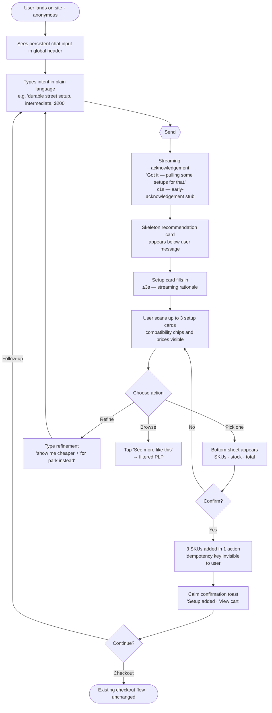
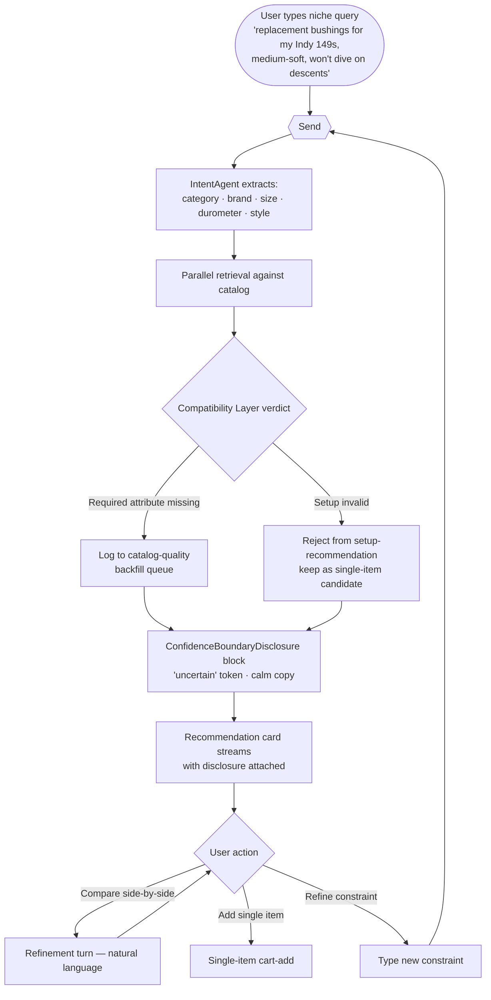
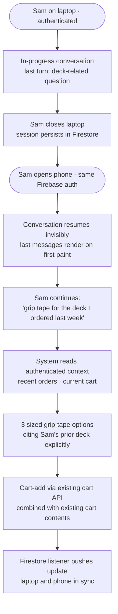
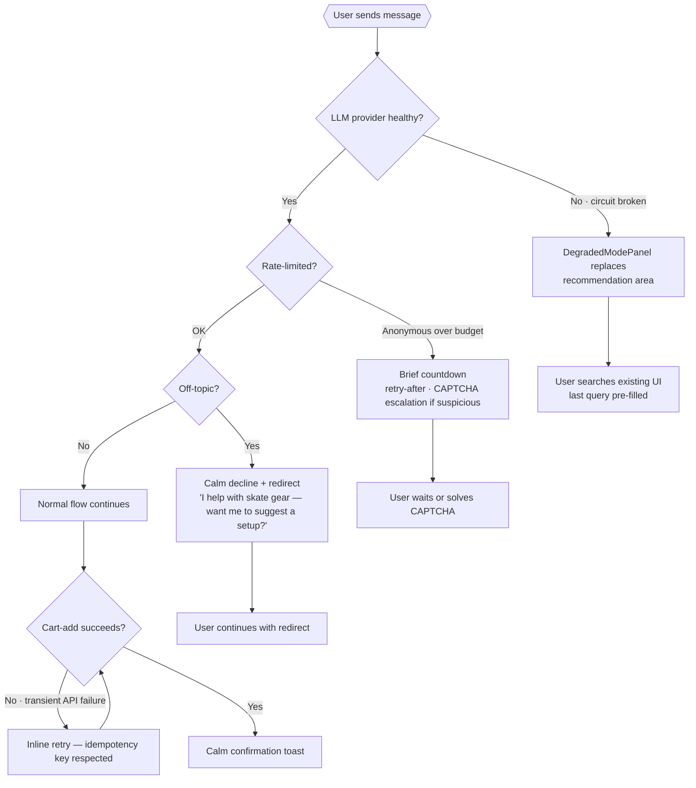
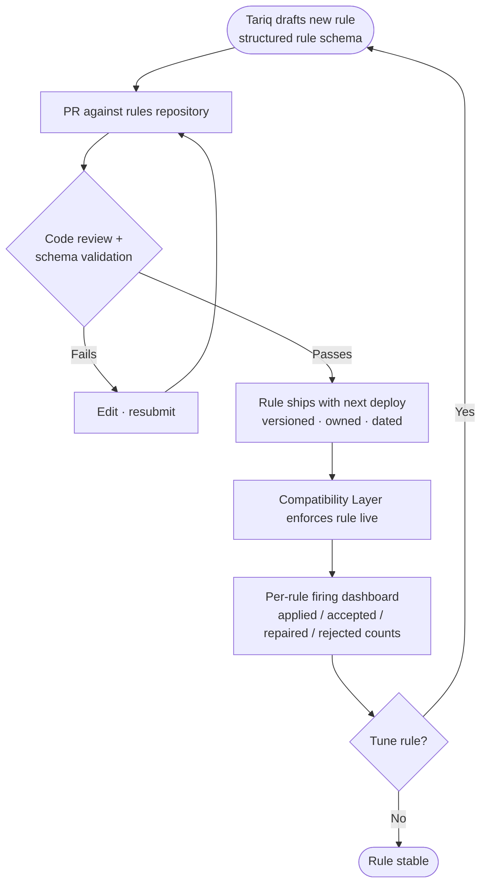

---
stepsCompleted:
  - step-01-init
  - step-02-discovery
  - step-03-core-experience
  - step-04-emotional-response
  - step-05-inspiration
  - step-06-design-system
  - step-07-defining-experience
  - step-08-visual-foundation
  - step-09-design-directions
  - step-10-user-journeys
  - step-11-component-strategy
  - step-12-ux-patterns
  - step-13-responsive-accessibility
  - step-14-complete
status: complete
completedAt: 2026-05-06
lastStep: 14
inputDocuments:
  - _bmad-output/planning-artifacts/prd.md
  - _bmad-output/planning-artifacts/product-brief-skate-ecommerce.md
documentCounts:
  prd: 1
  briefs: 1
  other: 0
projectType: 'brownfield-extension'
designDirection:
  referenceFrame: 'Modern e-commerce (Nike/Adidas) adapted to skate/urban culture'
  experienceModel: 'Hybrid — assistant embedded as first-class entry point + structured product browsing'
  aestheticBase: 'Minimalist, dark/neutral, bold typography, raw sticker-style tags'
  toneOfVoice: 'Confident, direct, skate vernacular over corporate'
  primaryViewport: 'Mobile-first'
  nonNegotiables:
    - 'Compatibility & setup indicators are first-class visual elements'
    - 'Every recommendation surfaces why-this rationale tied to stated intent'
    - 'No chatbot mascot, no playful illustrations, no emoji'
    - 'AI-disclosure is single confident line, not apologetic'
---

# UX Design Specification — skate-ecommerce AI Shopping Assistant

**Author:** Jeremycamusvarela
**Date:** 2026-05-06

---

<!-- UX design content will be appended sequentially through collaborative workflow steps -->

## Executive Summary

### Project Vision

A single, coherent commerce surface where **conversational discovery and structured product browsing coexist**. The assistant is embedded in the e-commerce experience as a first-class entry point, not a chatbot bolted onto the corner of the page. Users move fluidly between asking the assistant ("durable street setup, intermediate, around $200") and browsing recommended setups in a Nike/Adidas-grade product grid, with **compatibility validation made visible at every step**.

The UX must read as a credible skate retailer that happens to have an AI staffer, not as an "AI demo." Aesthetic frame: minimalist base (Nike/Adidas) overlaid with skate/urban elements — dark/neutral surfaces, bold sans-serif display type, raw sticker-style attribute tags, generous whitespace, no playful illustrations or anthropomorphic mascot. Tone of voice: confident, direct, skater vernacular.

### Target Users

**Primary — Anonymous discovery shopper (persona: Maya, PRD Journey 1).** Mobile-first, top-of-funnel, low patience, likely on a phone. Tech-savvy enough for chat UI but not for technical faceted search. Won't tolerate friction; will close the tab if the assistant feels gimmicky or slow. UX must establish **trustworthiness on first interaction**.

**Secondary — Authenticated returning shopper (persona: Sam, PRD Journey 3).** Cross-device usage (laptop ↔ phone). Expects continuity without re-prompting. Returns to refine prior conversations. UX must make resume-state feel **invisible**.

**Edge-case primary — Domain-savvy buyer (persona: Diego, PRD Journey 2).** Knows the vocabulary, will catch fabricated answers. UX must be **honest about confidence boundaries**, with visual treatments for partial-data recommendations (e.g., "matched durometer; no downhill tag in our catalog yet").

**Internal users — separate UX surfaces, in scope for v1:**

- **AI Ops engineer (Priya, PRD Journey 4):** observability dashboard for relevance, latency, cost, per-agent eval slices.
- **Compatibility-Layer rule author (Tariq, PRD Journey 5):** rule authoring and review surfaces, per-rule firing dashboards.

**Devices.** Mobile is the primary viewport; desktop and tablet are required. Thumb-reachable chat input on mobile is non-negotiable.

**Contexts of use.** Maya is exploratory (couch, evening). Sam is in-progress refinement (commute, between meetings). Diego is targeted lookup (focused desktop session). The UX must respect these tempos — no forced full-screen takeover, no modal walls between steps.

### Key Design Challenges

1. **Hybrid-UI coherence.** Chat and product grid must feel like one product. Transitions — *user asks → system responds inline → user clicks into PDP → user returns to chat* — must be seamless. The common failure mode (treating chat as a parallel side panel) must be avoided.
2. **Streaming explanation UX without "chatbot" feel.** Tokens stream into a recommendation card while it's being built. The visual must read as *the card filling in*, not *a chatbot typing*. Skeleton → streamed text → final card. No cute "thinking…" animations.
3. **Trust signals at every layer, without visual noise.** Every recommendation needs a compatibility-validated badge, a *why this* rationale, and AI-disclosure framing — but the surface must remain calm. Trust UX has to be quiet, consistent, and persistent.
4. **Compatibility-validated setup visualization.** A complete setup recommendation involves three SKUs grouped with shared rationale and one CTA. This **setup-card-stack** is novel to this product. It must work at 320 px viewport.
5. **Anonymous-to-authenticated bridge.** Anonymous users get full recommendation quality. Auth adds continuity and personalization. The UX must avoid a hard auth wall while surfacing the auth value proposition at the right moment (e.g., a non-blocking "Save this conversation to resume on your phone" affordance, not a login modal).
6. **Graceful degradation UX.** When the LLM circuit-breaker trips and the system falls back to keyword search, the transition must be clear and unalarming ("Search by keyword while the assistant is busy" — confidence preserved, vocabulary unchanged).
7. **Multi-turn clarification without interrogation feel.** Clarification turns must be brief, visually distinct from recommendation turns, and skippable. They cannot devolve into a forms-style Q&A or feel like the assistant is gatekeeping.

### Design Opportunities

1. **Setup-card-stack as a signature pattern.** A purpose-built UI element grouping deck + trucks + wheels with a unified "Add setup" CTA and a visible compatibility-validated badge. Distinctive to this product, reusable on PLPs (Phase 2 reuse), brand-defining.
2. **Compatibility chip as a site-wide trust layer.** The same "Pairs with…" / "Setup-validated" chip used in chat can ship on PDPs/PLPs in Phase 2 — a visual through-line that signals *this site validates compatibility, period*. Becomes a reason-to-use across the entire site.
3. **Skater-vernacular microcopy as a moat.** *"Bombproof, slightly heavier"* lands differently than *"premium durability, increased weight."* Voice differentiation requires no engineering investment, sustains across model upgrades, and is hard for competitors to copy without hiring domain talent.
4. **Honest-confidence UX as a brand asset.** Most LLM commerce surfaces hide model uncertainty. Surfacing it ("matched what I could; here's where the catalog is thin") aligns with a domain-knowledgeable audience and reinforces the *deterministic commerce with an LLM front door* positioning.
5. **Recommendation card doubles as cart-add affordance.** Inline confirm-to-cart from the chat surface, no PDP detour required for setups. Drops clicks-to-cart and visually demonstrates the product's core value proposition (intent → coherent cart-ready recommendation in one move).

## Core User Experience

### Defining Experience

The core loop the entire UX is optimized for:

> **State intent → receive coherent, compatibility-validated recommendation → confirm to cart.**

Every design decision accelerates or reinforces this loop. Secondary actions (browse a category, refine, compare, opt-out, resume on another device) orbit around it without diluting it. The signature moment of the product — the *aha* — is when a user types a plain-language request and within seconds sees three coherent setups they could buy with one confirmation, each with skater-vernacular trade-offs. That moment is the loop's payoff and what every screen, transition, and microcopy choice must serve.

### Platform Strategy

- **Mobile-first responsive web application** delivered by the existing Next.js platform. No native mobile app in v1.
- **Single codebase** for both the embedded chat affordance (on existing platform pages: home, PLP, PDP, cart) and the dedicated full-screen chat route. The same React components render in both contexts.
- **Touch-primary on mobile and tablet; full mouse + keyboard support on desktop.** Streaming UI must feel native on each.
- **No offline mode** in v1. Network failure surfaces a calm "reconnecting…" state and queues the user's last message for retry.
- **Device capabilities leveraged.** Viewport-aware layouts (320 px → desktop). `prefers-reduced-motion` respected. `prefers-color-scheme` informs default theme — dark default fits the urban aesthetic; light theme available. Firebase ID-token persistence for authenticated users via httpOnly cookie + client SDK.
- **Browser support.** Evergreen Chrome, Firefox, Safari, Edge (latest 2 majors); Mobile Safari and Chrome Android required.
- **Existing platform pages remain server-rendered** and are not modified. The chat widget is code-split and lazy-loaded — it does not ship on pages where the user has not engaged it (NFR5).

### Effortless Interactions

The interactions where zero friction is the standard:

- **Starting a conversation.** No login wall, no CAPTCHA gate, no onboarding tutorial. Persistent chat input in the global header — user types a sentence and the assistant responds. First message to first token is < 1 second (NFR2).
- **Recommendation → cart in one action.** The setup-card-stack carries a single "Add setup" CTA. No PDP detour required for setups; product details are inline-expandable on the card itself.
- **Resume on another device (authenticated users).** A Firebase ID token plus Firestore listener brings the last conversation forward immediately. No "Resume" button click, no reconnection ceremony — just the last messages visible on first paint.
- **Refinement in natural language.** "Show me cheaper options" / "compare these" / "how about for park instead?" — interpreted by the IntentAgent. No separate filter UI to learn.
- **Mode switching.** User can hand off from chat → filtered PLP (`see more like this`) → PDP → back to chat without losing thread. Conversation state persists across these transitions.
- **Opting out of history.** A single, discoverable affordance to disable persistent conversation history (auth users only). One click, no modal-confirm-modal-confirm chain.

### Critical Success Moments

The moments that define whether the product wins or loses:

1. **First-token response on the first message (Maya's moment).** Maya has decided in ≤1 second whether the assistant feels alive. TTFT < 1s with a confident, on-brand acknowledgement ("Got it — pulling some setups for that.") is non-negotiable. The early-acknowledgement stub from the fast model exists for this moment.
2. **First setup recommendation rendered.** The visual quality, copy quality, and SKU quality of the first three setups Maya sees define her trust in the product. Generic stock imagery, mismatched compatibility, or marketing-flavored prose are the fastest path to abandonment.
3. **Cart-add confirmation.** The transition from *exploring* to *committing*. A clean confirmation panel with SKUs, stock, total price, and an unambiguous "Add to cart" affordance — followed by a calm confirmation toast. Idempotency-key feedback prevents double-add, but the user never sees the mechanism.
4. **Honest-confidence disclosure (Diego's moment).** When the assistant surfaces a confidence boundary — *"matched durometer; no downhill tag in our catalog yet"* — the user either gains trust or leaves forever. The UX of that disclosure must be calm, specific, and visually distinct from a "we don't know" failure state.
5. **Cross-device resume (Sam's moment).** First time Sam opens the platform on phone after a desktop conversation and sees the conversation just there — that's the authenticated value proposition made visible.
6. **Circuit-breaker fallback.** When the LLM is degraded and the system falls back to keyword search, the UX transition must be confident: "Search by keyword while the assistant is busy" — not "something went wrong." This is the difference between a graceful product and a fragile one.

### Experience Principles

The seven guiding principles for every UX decision in this product:

1. **Embedded, not adjacent.** The assistant is a native part of the platform's commerce surface, not a chat panel bolted beside it. Chat input lives in the global header; recommendations render as native product cards.
2. **Trust is quiet and persistent.** Compatibility-validated badges, *why this* rationales, and AI-disclosure are present everywhere but never noisy. The brand is calm authority, not flashy demos.
3. **Hybrid by design.** Conversation and structured browsing are both first-class. Users move fluidly between them without context loss.
4. **Mobile-first, thumb-first.** Every primary interaction is reachable with one thumb on a 320 px viewport. Desktop is a progressive enhancement.
5. **Honest before flattering.** When the catalog is thin or the assistant is uncertain, say so plainly. Honest UX outperforms confident-sounding fabrication for a domain-knowledgeable audience.
6. **Skater voice over corporate voice.** Microcopy reads like a knowledgeable shop staffer, not a marketing department. *Bombproof, slightly heavier* over *premium durability, increased weight*.
7. **Streaming is the visual; speed is the brand.** Token streaming and TTFT < 1s are not engineering concerns — they are the perceptual quality of the UX. Latency budgets are design budgets.

## Desired Emotional Response

### Primary Emotional Goals

The product succeeds emotionally when users feel four things, in this order:

1. **Confidence.** The user feels they're talking to someone who knows skateboarding — not someone selling them on AI. The product asserts domain authority calmly, not loudly.
2. **Trust through honesty.** The user's confidence in a recommendation *grows* when the system is transparent about what it knows and doesn't know. Honesty is not a fallback for the system; it's a feature of the product.
3. **Belonging.** The platform feels like the *right place for skaters* — not a generic athletic-goods retailer using "skate" as an SEO keyword. The aesthetic, vocabulary, and attention to setup compatibility tell the user "we're one of you."
4. **Flow.** The core loop — intent → recommendation → cart — feels fluid and tactile. Fast, responsive, no laborious clicks or modal walls.

The emotional payoff if a user tells a friend: *"this site actually knows what they're talking about — they helped me build a setup in like two minutes, and the parts actually work together."*

### Emotional Journey Mapping

| Stage | Desired feeling | UX delivery |
|---|---|---|
| **Discovery / first message typed** | Curiosity → quiet confidence within ≈1 second | Sub-second TTFT with a confident on-brand acknowledgement; no spinner ceremony |
| **During recommendation generation** | Anticipation, **not** anxiety | Streaming text + skeleton card visualizes *the system working*, not *the system stalling* |
| **First recommendation rendered** | Recognition → trust | Compatibility-validated badge + skater-vernacular trade-off explanation = *"they get it"* |
| **Refinement turn ("show me cheaper")** | Empowerment | Natural-language refinement works; no separate filter UI to learn; user feels in control |
| **Cart-add confirmation** | Decisiveness, **not** hesitation | Clean confirmation panel with stock + price; idempotency invisible to user; calm confirmation toast |
| **Confidence boundary disclosed** | Respected, **not** rejected | "Matched durometer; no downhill tag yet" reads as a peer-to-peer acknowledgement, not an error |
| **System degraded (circuit-breaker)** | Calm, **not** alarmed | "Search by keyword while the assistant is busy" — confidence preserved, vocabulary unchanged |
| **Cross-device resume (auth)** | Continuity feels invisible | Last conversation is *just there* — no "Welcome back!" performance |
| **Returning later** | Familiarity without nostalgia | The platform recognizes the user; it does not perform recognition |

### Micro-Emotions

**Cultivate:**

- **Confidence over confusion.** Every screen tells the user where they are and what to do next.
- **Trust over skepticism.** Honest confidence boundaries; visible compatibility validation; no marketing puffery.
- **Belonging over isolation.** Skater vernacular, urban aesthetic, real product photography — not stock images.
- **Accomplishment over frustration.** The setup-card-stack lets the user finish the loop in a single gesture.
- **Calm over urgency.** No pressure tactics, no countdown badges, no anxiety-driven CTAs.

**Actively avoid:**

- **Anxiety** from slow responses, opaque AI behavior, or hidden costs.
- **Condescension** from over-explaining, mandatory tutorials, or treating users like they don't know skateboarding.
- **Sterility** from corporate-flavored microcopy.
- **Dependence on the AI** — the user should feel in control of the conversation, not impressed by the assistant.
- **Embarrassment** from a wrong recommendation the user has to debug or undo.

### Design Implications

The mapping from emotion to concrete UX choices:

| Emotional goal | UX design implication |
|---|---|
| **Confidence** | Persistent compatibility-validated badges; *why this* rationale on every recommendation; visible setup grouping; attribute chips. The product asserts itself; the user feels grounded. |
| **Trust through honesty** | Confidence-boundary disclosures get a calm, dedicated visual treatment — visually distinct from error states. Catalog-thin acknowledgements are framed as a feature, not buried as a footnote. |
| **Belonging** | Skater vernacular in all microcopy. Real product photography (no generic stock). Sticker-style attribute tags. Dark/neutral surfaces. No emoji, no anthropomorphic mascot. |
| **Flow** | Streaming card-fill (not "thinking…" animation). Inline cart-add from the recommendation card. No modal walls between steps. Persistent chat input in the global header. Resume-state appears without ceremony. |
| **Calm under pressure** | Circuit-breaker fallback uses calm, declarative copy. Loading uses skeletons, not spinners. No alarm icons on degraded states. Errors are framed as *what to do next*, not *what went wrong*. |
| **Honest respect** | No condescending tooltips. No mandatory onboarding tutorial. Default assumption: the user is competent. Onboarding happens by doing, not by instruction. |

### Emotional Design Principles

The six principles guiding every emotional choice in the product:

1. **Confidence is earned, not performed.** The product never says *"I'm AI-powered!"* or *"Try our smart assistant!"* It behaves competently and lets the user notice. AI-disclosure is a single confident line, not a sales pitch.
2. **Honest beats impressive.** When the system surfaces uncertainty, that is a feature. The disclosure UX is calm, specific, and treats the user as a peer.
3. **Belonging through specificity.** Skater vernacular, real boards, urban aesthetic, attention to setup compatibility. Cultural specificity beats generic e-commerce polish for *this* audience.
4. **Speed is an emotion.** Sub-second response feels alive; multi-second response feels broken. The latency budgets in the PRD are emotional commitments, not just engineering targets.
5. **The user drives; the assistant assists.** No AI action without user confirmation. No sneaky upsells. No required login to use core features. Agency stays with the user at every step.
6. **Calm under all conditions.** Streaming, fallback, error, recovery — all states share the same calm visual register. The product never panics. Composure is the brand.

## UX Pattern Analysis & Inspiration

### Inspiring Products Analysis

**Nike (nike.com, SNKRS app) — bold-typography product hierarchy**

- Strong typographic hierarchy (display fonts for product names, oversized hero imagery, generous whitespace).
- Product detail pages read as editorial, not transactional — every product has narrative.
- Sticky / persistent navigation; mobile experience polished and thumb-reachable.
- *Adopt:* hero imagery treatment, display-font hierarchy, narrative-flavored product detail.
- *Adapt:* swap marketing "story behind the shoe" for *"what it's good for in skater terms"* — same depth, different voice.
- *Avoid:* hype-driven scarcity (drops, countdowns) — wrong tone for an assistant-driven, calm-authority commerce flow.

**Adidas (adidas.com) — clean grid + facet sophistication**

- Clean PLP grid with generous whitespace and high-contrast product photography.
- Strong faceted-filter UI; "Picks for you" framing for personalized recommendations.
- *Adopt:* PLP grid density, photography conventions, "Picks for you" framing pattern (we'll repurpose for assistant-recommended sets).
- *Adapt:* their facet UI is jewelry-store-grade; for us, faceted browse is a *fallback* for users who don't want to chat — not the primary discovery surface.
- *Avoid:* overproduced lifestyle photography that subordinates skate authenticity to luxury polish.

**Vans / Carhartt WIP / Palace Skateboards — skate-brand cultural authority**

- Editorial product copy in genuine skater vernacular, not marketing language.
- Real-world product photography (people skating, real shop floors, real spots) instead of studio model shots.
- Sticker-style graphic language and tag-based information design as authentic skate-graphic culture.
- Dark / neutral palettes with raw graphic accents.
- *Adopt:* editorial copy voice, photography conventions, sticker-style attribute tags, dark/neutral palette.
- *Adapt:* their UX is often subordinate to brand storytelling; we need to keep functional commerce primary while inheriting their cultural register.
- *Avoid:* Palace-style intentionally chaotic UX — on-brand for them, wrong for an assistant-driven commerce flow.

**Amazon Rufus — embedded conversational commerce**

- Chat affordance lives within the existing site shell, not as a corner-floating bubble.
- Recommendations render as native product cards inside chat responses.
- Low-key visual register — the assistant doesn't dominate the page; it augments it.
- *Adopt:* embedded-not-adjacent chat philosophy; native product cards in chat; low-key visual register.
- *Adapt:* Rufus is breadth-first across all of Amazon; we're depth-first in skate. Our recommendations carry richer per-product compatibility/setup signal.
- *Avoid:* Rufus's tendency toward generic, marketing-flavored explanations. Our explanations are skater-vernacular and trade-off-explicit.

**Instacart "Ask Instacart" — LLM-constrained selection from catalog**

- LLM is constrained to selecting/ranking from a curated catalog; never free-generates product attributes.
- AI framed as a search-quality lift, not a replacement for structured browse.
- *Adopt:* LLM-constrained-selection pattern (already in our architecture via the Compatibility Layer + structured retrieval).
- *Adapt:* their UI is grocery-functional; we want skate-cultural with the same structural rigor.
- *Avoid:* over-claiming the AI's judgment; framing recommendations as "the AI says X" rather than "here's why this fits what you described."

**Linear / Vercel — calm-authority modern-web aesthetic**

- Dark default theme, generous whitespace, monospace for technical/structured data.
- Inline-editable interactions; minimal modal use.
- Streaming UX done well — Vercel deploy logs feel alive without feeling chatty; Linear's command palette streams results inline.
- Keyboard-first on desktop; respects power users without alienating casual users.
- *Adopt:* color/space discipline; monospace for technical attributes (durometer, deck dimensions, axle widths); streaming patterns done with restraint; no-modal-walls philosophy.
- *Adapt:* their B2B-developer audience runs colder than ours — add cultural warmth (skater vernacular, real photography) on top of the structural minimalism.
- *Avoid:* the hyper-minimal aesthetic could feel sterile for a consumer skate audience if applied uncritically; warmth comes from copy and imagery, not from clutter.

### Transferable UX Patterns

**Navigation patterns:**

- Persistent global header with **embedded chat input** as a first-class entry point (Rufus + Adidas combined).
- Mobile bottom tab bar for major site sections (Vans / Carhartt mobile pattern), with chat reachable from any tab.
- "Continue conversation" affordance for authenticated users on app open (Slack-style continuity treatment, calm not flashy).

**Interaction patterns:**

- **Inline cart-add from a recommendation card** (Adidas/Nike PDP CTA pattern, repurposed inside the chat surface).
- **Streamed text into a card frame** (Vercel deploy log + Rufus answer streaming, repurposed as recommendation cards filling in).
- **Natural-language refinement** (Instacart's "show me cheaper" pattern; same input field, no separate filter UI).
- **Skeleton states for loading**, never spinners (modern-web standard).
- **Bottom-sheet confirmations on mobile** for cart-add (modern native pattern; mobile-thumb-reachable, in-context, not full-screen modal).

**Visual patterns:**

- Dark default theme with high-contrast product imagery (Nike + Linear).
- Bold display sans-serif for headers; monospace for technical/numeric attributes (Linear/Vercel).
- **Sticker-style attribute tags** as a recurring information-design motif (Vans / Palace cultural signature, made functional).
- Real-world product photography (skate-brand convention) — never studio stock.
- **Compatibility chip** as a recurring visual motif (custom — our signature pattern, no precedent to copy).

### Anti-Patterns to Avoid

- **Floating chatbot bubble in the page corner** (Drift, Intercom, generic SaaS). Frames the assistant as a *help tool*, not a *discovery surface*. Wrong framing for this product.
- **AI mascot or anthropomorphization** (Cortana, Clippy, "🤖 Hi! I'm…"). Undermines credibility with the skater audience and contradicts the user direction.
- **Hype-driven scarcity overlays** (SNKRS-style countdowns, "only 3 left" badges). Wrong tone — manufactured urgency contradicts calm authority.
- **Modal-walls navigation** between recommendation, confirmation, and cart. Interrupts the core loop. We use inline panels and bottom sheets instead.
- **Forms-style multi-turn clarification** (typical chatbot UIs). Feels like an interrogation. Clarifications must feel conversational, brief, and skippable.
- **Generic stock photography** of models holding boards. Kills belonging instantly for a domain audience.
- **Marketing-flavored microcopy** ("Discover the perfect ride for your unique style!"). Sterilizes the brand voice. Skater vernacular only.
- **"AI demo" framing** ("Try our smart shopping assistant!"). Undermines trust. Embed the assistant; let users notice it works.
- **Spinners** (vs. skeletons). Communicate "system is busy," not "system is working." Use skeleton states with streamed content fill.
- **Cute "thinking…" / typing animations** on the assistant. Chatbot-coded, undermines authority. Per user direction, ruled out.
- **Required login before using core features.** Forces friction; anonymous parity is a stated requirement (FR6, FR27).

### Design Inspiration Strategy

**Adopt directly:**

- Nike/Adidas grid + typographic hierarchy for PLPs and product cards.
- Vans/Carhartt skater editorial voice and real-world photography conventions.
- Linear/Vercel calm-authority aesthetic — dark default, monospace for technical data, no-modal-walls philosophy.
- Rufus's embedded-not-adjacent chat philosophy and native-card-rendering pattern.
- Instacart's LLM-constrained-selection pattern (already in our backend architecture; UX must reflect it visibly).

**Adapt to this product:**

- Nike-style narrative product detail → skater-vernacular *what it's good for / trade-offs* framing.
- Adidas faceted browse → relegated to a fallback path for users who don't want to chat; assistant is the primary discovery surface.
- Skate-brand sticker graphics → functional UI elements (attribute tags, badges, compatibility chips), not pure decoration.
- Vercel-style streaming → applied to recommendation cards filling in, not to console logs.
- "Picks for you" personalization framing → repurposed as "Setups that match what you described" — anchored to user-stated intent, not to opaque inferred preferences.

**Avoid in all cases:**

- Floating chatbot bubble UI; AI mascot or anthropomorphization; hype/scarcity tactics; generic stock photography; marketing-flavored copy; modal-walls navigation; spinners and "thinking…" animations; required login before core features.

The strategy: **structural rigor from modern web (Linear/Vercel/Rufus/Instacart) + visual hierarchy from sportswear retail (Nike/Adidas) + cultural warmth and vocabulary from skate brands (Vans/Carhartt/Palace).** Three reference layers, deliberately combined to avoid both sterile-tech and over-styled-retail failure modes.

## Design System Foundation

### Design System Choice

**Themeable foundation: Tailwind CSS + Radix UI primitives, with shadcn/ui as the curated starter component set; custom components built on top for product-signature patterns.**

This is the dominant 2026-era pattern for product-quality custom designs in the Next.js ecosystem and is what powers most of the calm-authority modern web (Vercel, Linear-adjacent products, the Vercel Marketplace, and a substantial portion of well-designed e-commerce in the React ecosystem). It is not a single off-the-shelf design system — it is a foundation that gives us:

- **Tight control over the calm-authority aesthetic** (color tokens, spacing scale, typography, radius scale) via Tailwind config.
- **Accessibility-by-default for primitives** (dialog, popover, tabs, dropdown, accordion, slider, toast, focus management, keyboard interaction) via Radix UI — WCAG 2.2 AA compliance is dramatically cheaper with Radix than building from scratch (NFR26–NFR30).
- **No library lock-in** — shadcn/ui components are copied into the codebase, owned and modified directly by the team. Library upgrades are non-events.
- **No runtime CSS-in-JS overhead** — compatible with the lazy-load-the-chat-widget bundle requirement (NFR5) and with SSR on existing platform pages.
- **Streaming text, skeleton states, and inline animations** are idiomatic in this stack.

### Rationale for Selection

| Decision factor | Why this stack wins |
|---|---|
| **Aesthetic uniqueness** | Material Design / Ant Design baselines force a "looks like Google" or "looks like enterprise" register. Tailwind + Radix is a blank canvas; we build the urban/skate visual language directly. |
| **Accessibility commitment (WCAG 2.2 AA, NFR26–NFR30)** | Radix primitives ship with focus management, keyboard interactions, ARIA semantics, and screen-reader behavior already correct. Building these from scratch on schedule is unrealistic. |
| **Mobile-first responsive (NFR30)** | Tailwind's responsive utility model and viewport-based sizing primitives are designed for mobile-first. Touch-target conformance (≥44 px) is enforceable via design tokens. |
| **Streaming UX, skeletons, no spinners (Step 4)** | Streaming text into a card frame is straightforward in plain React with Tailwind; no library-imposed loading patterns to fight against. |
| **Dark default + light theme** | Tailwind's CSS-variable theming model lets dark and light share components; `prefers-color-scheme` works out of the box. |
| **Existing platform integration (brownfield)** | Tailwind is widely used in Next.js apps; if the existing platform already uses Tailwind, integration is trivial. If it does not, the assistant widget can be scoped to its own Tailwind layer without affecting the host. |
| **Performance and bundle size (NFR5)** | No runtime CSS-in-JS; tree-shakable component imports; chat widget can be code-split aggressively. |
| **Long-term maintenance** | Owned components beat third-party-library churn. shadcn/ui's "copy-not-install" philosophy aligns with brownfield ownership. |

### Implementation Approach

**Foundation layer:**

- **Tailwind CSS** (latest, configured for project tokens) — utility CSS for layout, spacing, typography, and color.
- **Radix UI primitives** — accessible, unstyled component primitives (`@radix-ui/react-*`).
- **shadcn/ui starter components** — Button, Input, Dialog, Sheet, Toast, Tabs, Tooltip, Accordion, Popover, Skeleton, ScrollArea, Avatar, Badge, Card. Copied into the repo, owned by the team.

**Design tokens (CSS variables, Tailwind-config exposed):**

- **Color** — semantic palette: `surface`, `surface-elevated`, `surface-overlay`, `text-primary`, `text-secondary`, `text-muted`, `border`, `border-subtle`, `accent` (single brand accent, used sparingly), `success` (a.k.a. *grounded*, for compatibility-validated states), `warning` (a.k.a. *uncertain*, for confidence-boundary disclosures — visually distinct from error), `error`. Dark and light variants share component code.
- **Typography** — three families: a bold display sans-serif (Inter Display, Söhne, or equivalent — final selection in Step 9 component spec) for headers and product names; a workhorse text sans (Inter or Söhne Buch) for body and UI; a monospace (JetBrains Mono or Geist Mono) for technical numeric attributes (durometer values, deck dimensions, axle widths). Three sizes are reserved for the *display* face; the rest of the type scale uses the text face.
- **Spacing** — Tailwind 4 px base unit with a tight scale; touch-target floor enforced at 44 px (NFR30).
- **Radius** — minimal: `rounded-none` on cards (skate-graphic register), `rounded-sm` on chips, `rounded-full` on sticker tags and avatars. No heavy corner rounding (would read as friendly/playful — wrong tone).
- **Iconography** — Lucide line icons as default, augmented by a small set of skate-specific custom glyphs (deck silhouette, truck profile, wheel circle) used in compatibility indicators only.

**Custom components to build on top (signature patterns; full spec in Step 9):**

- `SetupCardStack` — the deck+trucks+wheels grouped recommendation with a single "Add setup" CTA and a unified compatibility-validated badge.
- `CompatibilityChip` — recurring "Pairs with…" / "Setup-validated" indicator across chat, recommendation cards, and (Phase 2) PDP/PLP.
- `RecommendationCard` — supports streaming text fill, attribute chips, why-this rationale, inline cart-add.
- `WhyThisRationale` — the calm explanation block tied to the user's stated intent.
- `ConfidenceBoundaryDisclosure` — calm "matched what I could" disclosure, visually distinct from error states.
- `StickerTag` — sticker-style attribute tag (Style: Street, Skill: Beginner, In Stock).
- `ChatInput` — persistent chat affordance docked in the global header (desktop) and bottom (mobile).
- `ConversationStream` — message thread layout with streaming-card support.
- `DegradedModePanel` — circuit-breaker fallback panel that frames keyword-search handoff as confident, not failed.
- `OpsDashboard*` — internal-user dashboard components for AI Ops engineer (Priya) and rule author (Tariq) surfaces.

### Customization Strategy

**Token-first customization.** All visual decisions are encoded as design tokens (CSS variables exposed via Tailwind config). Component code references tokens, never raw values. Theming, branding, or light-theme support is a token-swap, not a component rewrite.

**Component-level Tailwind classes** for layout, spacing, and one-off variations within shadcn/ui-derived components.

**Direct ownership of every component** in the repo — no `npm install @some-design-system`. shadcn/ui's "copy not install" is the working model: components are copied in, modified for our needs, and owned by the team going forward.

**Storybook** (or alternative — Ladle, Histoire) for component development and visual review. Component-level accessibility testing via `axe-core` integrated into CI; storybook stories double as the input to automated accessibility checks.

**Accessibility-as-token.** Focus-ring, contrast ratios, motion-reduced variants, and touch-target floors are encoded as tokens enforced by lint rules where possible. WCAG 2.2 AA conformance is a CI gate (axe-core), not a manual review at the end.

**Brand layer thin and replaceable.** The skate/urban visual register lives in the token layer (color, typography, sticker tags, iconography), not deeply embedded in component logic. If the platform ever extends to other categories, the design system can be re-themed without rewriting components.

## 2. Core User Experience

### 2.1 Defining Experience

The single interaction that, if nailed, defines the product:

> **The user types a plain-language sentence about what they want, sees coherent compatibility-validated setups appear within seconds, and confirms one to cart in a single action.**

When a user describes this product to a friend, the sentence is: *"I just typed what I wanted and three setups came up that actually work together — added one to cart, done."* That sentence is the brand. Every UX decision must serve it.

Compared to skate-industry-standard alternatives, this defining interaction:

- **vs. Faceted search:** collapses three faceted-attribute decisions (deck width, truck size, wheel hardness) into one natural-language input.
- **vs. Manual setup-building:** collapses three independent product-detail-page visits and three add-to-cart actions into one.
- **vs. Generic chatbot:** returns *coherent groupings* of products (not single items), with *compatibility validated* (not just keyword-matched), with *trade-off explanations* (not just attribute lists).

### 2.2 User Mental Model

How target users currently think about skate purchasing:

- **Beginners (Maya).** *"I want a board for skating around and trying tricks."* Mental model is **outcome-first**: they think about what they want to do, not what attributes a board needs. They don't have vocabulary for deck width, truck size, or durometer. Faceted search and PDPs overwhelm them.
- **Domain users (Diego).** *"I need bushings for Indy 149s, medium-soft, won't dive on descents."* Mental model is **attribute-rich and use-context-rich**: they know the parts and brand vocabulary but state intent in *use cases* (descents, dive resistance) that *map to* but are not identical to catalog attributes.
- **Returning users (Sam).** *"Last week I ordered a deck; I need grip tape for it."* Mental model is **contextual to their history**: they expect the system to know what they already own.

Common ground across all three: users state intent in *natural language tied to use*, not in *attribute filters*. The defining UX must accept the user's mental model as-is and never force them to adopt a system mental model.

Where users currently get confused or frustrated:

- **Faceted search** demands intent → attributes → filters in a vocabulary they don't necessarily speak.
- **Single-item PDPs** make them solve the systems problem (compatibility) themselves.
- **Generic recommendation engines** ("You may also like") don't tie suggestions to stated intent.
- **Chatbots** typically interrogate ("What's your skill level? What's your budget?") before delivering value — feels like a form, not a conversation.

The mental model the UX must *not* require:

- Knowing inches of deck width.
- Knowing wheel durometer numbers.
- Knowing truck axle measurements.
- Understanding cross-product compatibility rules.
- Knowing brand-specific sizing variations (Indy vs. Thunder mm).

### 2.3 Success Criteria

The defining interaction succeeds when:

| Indicator | Target / Source |
|---|---|
| **First-token feedback** | ≤ 1 s P95 (NFR2) — the user sees the system is alive |
| **Time to first recommendation card visible** | ≤ 3 s P95 end-to-end (NFR1) |
| **Setup-completion rate** | User reaches setup-add confirmation in ≤ 3 turns at the 95th percentile (PRD User Success criterion) |
| **Setup attach rate** | ≥ 2 of 3 of deck/trucks/wheels in cart when a setup was proposed (PRD Business Success) |
| **No-PDP-detour completion** | The user can complete a setup add without leaving the chat surface |
| **One-thumb completion on mobile** | Entire defining flow completable with one thumb on 320 px viewport (NFR30) |
| **Refinement in natural language** | *"Show me cheaper options"* / *"compare these"* / *"how about for park instead?"* works without UI-hunting |
| **Confidence-boundary disclosure (Diego's case)** | When the system has imperfect data, it says so calmly — not silently degraded, not erroring (PRD Journey 2) |
| **Hallucination floor** | Zero hallucinated SKUs in production (PRD NFR38) |

The user *feels successful* when:

- They got an answer that fits what they asked, fast.
- The recommended products explained why they were the answer, in their language.
- They committed to a purchase without second-guessing themselves on compatibility.
- They never had to click into a product detail page or fight a faceted filter.

### 2.4 Novel UX Patterns

**Novel patterns (require subtle introduction):**

- **Setup-card-stack as a single buyable unit.** Treating three SKUs as one visual entity with one CTA is uncommon in e-commerce. We introduce it through (a) visual grouping (shared border, unified header, common attribute strip), (b) a single "Add setup" CTA, and (c) the why-this rationale block tying the three items together.
- **Compatibility-validated badge as a recurring trust motif.** "Setup-validated" / "Pairs with…" chips are not standard e-commerce. They appear frequently and consistently so users learn to recognize them as *this product's* trust signal — across chat, recommendation cards, and (Phase 2) PDP/PLP surfaces.
- **Confidence-boundary disclosure (Diego's case).** Calmly admitting *"we don't have downhill tags yet"* is novel for an LLM-driven product. It gets a distinct visual treatment (`uncertain` color token, not `error`), a distinct copy register, and a distinct semantic role from a generic "no results" or error state.

**Established patterns (adopted as-is):**

- Streaming text UI (Vercel-style; users from ChatGPT and Claude already understand it).
- Bottom-sheet confirmation on mobile (modern native pattern, widely understood).
- Skeleton loading states (modern-web standard).
- Inline expandable sections for product detail (e-commerce standard).
- Send-message + thread layout (chat UX standard).

**The unique combination:**

The defining experience *combines* a chat-UX pattern (familiar from messaging apps and AI assistants) with an e-commerce-card-grid pattern (familiar from Nike/Adidas/Amazon) into a single coherent surface. Users recognize each pattern individually; the novelty is in the **integration**, not in any one component. We do not need to teach novel patterns from scratch — we need to teach that *these familiar patterns now share the same surface, fluidly*.

### 2.5 Experience Mechanics

The step-by-step flow for the defining interaction:

**1. Initiation**

- Persistent chat input visible in the global header (desktop) and docked bottom-of-viewport (mobile). Always available — no click-to-open required.
- Placeholder text rotates between three or four exemplar prompts: *"durable street setup, intermediate, around $200"* · *"wheels for cruising rough sidewalks"* · *"first board for a 12-year-old"* · *"replacement bushings for my Indy 149s"*. The placeholder is the onboarding — no tutorial required.
- No login required. No *"Hi! I'm…"* intro screen. The user types and sends.

**2. Interaction**

- User types a sentence and presses Enter (or taps Send on mobile).
- Within ≤ 1 s: streaming acknowledgement token appears in a confident on-brand line (e.g., *"Got it — pulling some setups for that."*). The early-acknowledgement stub from the fast-model layer (PRD architecture) lands here.
- A skeleton recommendation card appears below the user's message. The card frame is real; only its content is loading.
- Within ≤ 3 s: the first setup card fills in with deck + trucks + wheels SKUs, attribute chips, compatibility-validated badge, price/stock indicators, and streaming why-this rationale.
- Up to three setup cards render, the first appearing fastest, additional cards streaming in below.

**3. Feedback**

- Streaming text in the explanation block visualizes *the system composing the answer*, not *the system stalling*.
- Compatibility-validated badge appears on each card the moment validation completes.
- Attribute chips (Style, Skill, Stock) and price/stock indicators are visible at a glance — the user can scan three setups in under five seconds.
- If the system has reduced confidence (catalog gap), a `ConfidenceBoundaryDisclosure` block sits under the affected card with calm copy stating the boundary explicitly.
- If the user's intent triggers a clarifying question (intent underspecified), the system asks one calm question *instead* of returning recommendations. The clarification turn is visually distinct from a recommendation turn — short, conversational, easy to skip with a "just give me your best guess" affordance.

**4. Completion**

- User taps the "Add setup" CTA on the chosen card.
- A bottom-sheet (mobile) or inline confirmation panel (desktop) appears with SKUs, stock, total price, and an unambiguous "Confirm and add" affordance.
- User confirms. Three items land in the cart in one action via the existing cart API (with idempotency key, all-or-nothing semantics — invisible to the user).
- A calm confirmation toast appears: *"Setup added. View cart."*
- The chat surface persists. The user can ask a follow-up (*"anything I should add?"*) or hand off to checkout via the standard cart flow.

**Failure modes within the flow** (each handled with a defined visual + copy treatment):

- **LLM provider degraded.** Circuit-breaker trips → `DegradedModePanel` replaces the recommendation area, framing the keyword-search fallback confidently: *"Search by keyword while the assistant is busy."*
- **Rate-limited (anonymous abuse mitigation).** Brief explanation with retry-after countdown; no raw error code visible to the user.
- **Cart-add fails (existing cart API issue).** Inline retry with idempotency key respected; no double-add risk; calm copy framing it as a transient hiccup.
- **Catalog data thin.** `ConfidenceBoundaryDisclosure` appears with the recommendation; the recommendation still ships, with explicit framing of what the system *did* and *didn't* match.
- **Off-topic query.** The system declines gracefully and offers a redirect: *"I help with skate gear — want me to suggest a setup, or are you looking for something else on the site?"* No error register, no shame.

## Visual Design Foundation

### Color System

**Theme strategy:** dark default theme, light theme available. Both themes share component code via CSS-variable tokens. `prefers-color-scheme` honored on first visit; user can override per-session via header toggle.

**Semantic palette (token names — values shown for dark theme):**

| Token | Dark theme | Light theme | Role |
|---|---|---|---|
| `surface` | `#08090B` (near-black) | `#FAFAFA` (warm off-white) | Page background |
| `surface-elevated` | `#161618` | `#FFFFFF` | Card backgrounds |
| `surface-overlay` | `#1F1F22` | `#F4F4F5` | Modal, sheet, tooltip |
| `text-primary` | `#F5F5F4` (off-white, not pure) | `#0A0A0A` | Body and headings |
| `text-secondary` | `#A1A1AA` (zinc-400) | `#52525B` (zinc-600) | Secondary copy, labels |
| `text-muted` | `#71717A` (zinc-500) | `#71717A` | Placeholders, captions |
| `border` | `#27272A` (zinc-800) | `#E4E4E7` (zinc-200) | Card borders, dividers |
| `border-subtle` | `#1F1F22` | `#F4F4F5` | Inner dividers |
| `accent` | Signal Red `#F03A3A` | Same, contrast-adjusted | Primary CTA, brand accent |
| `success` *(grounded)* | `#22C55E` | `#16A34A` | Compatibility-validated state |
| `warning` *(uncertain)* | `#F59E0B` | `#D97706` | Confidence-boundary disclosure |
| `error` | `#EF4444` | `#DC2626` | Genuine errors only |

**Accent decision:** Signal Red `#F03A3A`. High-contrast, sportswear-coded (Nike-adjacent without copying), references skate-graphic danger/fire-extinguisher culture. Reads as confident, not playful.

The accent is used **sparingly**: primary CTAs, current-tab indicators, and the user's own message bubble in chat. Not on cards, not on body text, not on attribute chips.

**Critical color rules:**

- The `success` token is named `grounded` semantically — used only for compatibility-validated states, never for generic success.
- The `warning` token is named `uncertain` semantically — used only for confidence-boundary disclosures, **never** as an error proxy. This is what visually distinguishes Diego's "no downhill tag" disclosure from a genuine error.
- The `error` token is reserved for genuine system errors (network failure, validation failure). Catalog gaps, off-topic queries, and degraded-mode states do **not** use error styling.

**Contrast ratios (WCAG 2.2 AA, NFR26):**

| Pair (dark theme) | Ratio | Verdict |
|---|---|---|
| `text-primary` on `surface` | ≈ 17:1 | AAA (large + normal) |
| `text-primary` on `surface-elevated` | ≈ 14:1 | AAA |
| `text-secondary` on `surface` | ≈ 8:1 | AAA large, AA normal |
| `text-muted` on `surface` | ≈ 5:1 | AA |
| `accent` (Signal Red) on `surface` | ≈ 5.5:1 | AA |
| `success` on `surface` | ≈ 5.8:1 | AA |
| `warning` on `surface` | ≈ 9:1 | AAA |

Light-theme ratios verified to the same standard. CI enforces contrast via axe-core.

### Typography System

**Three type families:**

| Family | Use | Default selection |
|---|---|---|
| **Display** | Headers, product names, hero copy | **Geist Sans** (variable; open-source; modern-web aesthetic from Vercel/Linear references). Fallback stack: `system-ui, -apple-system, "Segoe UI", sans-serif` |
| **Text** | Body, UI labels, microcopy | **Geist Sans** (same family, different weight/tracking) for visual cohesion. Same fallback stack |
| **Mono** | Technical numeric attributes (durometer, deck dimensions, axle widths, prices) | **Geist Mono** (open-source). Fallback: `"JetBrains Mono", "Fira Code", ui-monospace, monospace` |

Single sans family across display/text avoids "two-font feel"; weight + tracking carry the hierarchy. Mono is a deliberate counterpoint for technical specifications, reinforcing the *deterministic* register of the product.

**Type scale (mobile-first, scales up on desktop where noted):**

| Token | Size / Line-height | Weight | Tracking | Use |
|---|---|---|---|---|
| `display-1` | 40 / 44 px | 700 | -0.02em | Hero, landing |
| `display-2` | 32 / 36 px | 700 | -0.02em | Section hero |
| `headline-1` | 24 / 28 px | 600 | -0.01em | Page titles |
| `headline-2` | 20 / 24 px | 600 | 0 | Section titles, card titles |
| `body-large` | 16 / 24 px | 400 | 0 | Default reading copy |
| `body` | 14 / 20 px | 400 | 0 | UI default |
| `caption` | 12 / 16 px | 400 | 0 | Labels, attribution, metadata |
| `tag` | 11 / 16 px | 600 | 0.1em (uppercase) | Sticker tags (Style: Street, In Stock) |
| `mono-body` | 14 / 20 px | 500 | 0 | Numeric attributes inline |
| `mono-caption` | 12 / 16 px | 500 | 0 | Numeric attributes in chips |

**Hierarchy rules:**

- Bold display tightens letter-spacing (-0.02em); body never goes negative on tracking.
- Sticker tags are **always** uppercase, tracked-wider, smaller — recognizable as a pattern.
- Numeric attributes (durometer, dimensions) **always** mono — visual signal that the value is exact.
- Maximum two display/headline levels per screen — no four-level type stacks.
- Body line length: 50–75 characters. Recommendation explanation prose constrained to ~60ch on desktop.

### Spacing & Layout Foundation

**Spacing scale (Tailwind 4 px base):**

| Token | px | Use |
|---|---|---|
| `space-1` | 4 | Inner chip padding |
| `space-2` | 8 | Tight gaps between related elements |
| `space-3` | 12 | Default card-internal gap |
| `space-4` | 16 | Default card padding |
| `space-6` | 24 | Between cards in lists / grids |
| `space-8` | 32 | Section spacing on mobile |
| `space-12` | 48 | Section spacing on desktop |
| `space-16` | 64 | Hero spacing, major dividers |

**Touch-target floor:** all interactive elements ≥ 44 × 44 px (NFR30). Enforced via lint rule on `<button>`, `<a>`, and Radix-derived interactive components.

**Grid system:**

- **Mobile (< 640 px):** single column, 16 px page padding, no horizontal gutter. Recommendation cards are full-width.
- **Tablet (640–1024 px):** 2-column grid, 24 px gutter, 24 px page padding. Cards render 2-up.
- **Desktop (≥ 1024 px):** 12-column grid, 32 px gutter, page max-width 1440 px, 32 px page padding. Cards render 3-up on PLP and on the chat-recommendations row.
- **Setup-card-stack:** stacked vertically on mobile (deck card → trucks card → wheels card → unified CTA); horizontally grouped on desktop (3 product cards in a single bordered container with shared header and unified CTA).

**Layout principles:**

1. **Generous whitespace around recommendations.** Calm-authority register. Cards breathe, don't crowd.
2. **Strong visual hierarchy within a card:** hero image (largest) → product name (display) → attribute chips (caption) → why-this rationale (body) → price (mono) → CTA (accent button).
3. **Sticky chat input.** Always reachable. Never scrolls off-screen. Bottom-docked on mobile (`env(safe-area-inset-bottom)` respected on iOS), top-docked or globally accessible on desktop.
4. **Setup-card-stack has stronger visual grouping** than three independent cards: shared border, unified header strip, single CTA. Reads as one buyable unit at a glance.
5. **No carousels for primary content.** Recommendation cards scroll vertically on mobile (with horizontal scroll only as a tertiary "see more variations" pattern); never as the primary discovery affordance — carousels hide content from screen readers and keyboard users.

### Accessibility Considerations

- **WCAG 2.2 AA conformance** across all surfaces (NFR26). CI gate via `axe-core`; failures block merge.
- **Color contrast:** all body text ≥ 4.5:1; large text (≥ 18 px regular or 14 px bold) ≥ 3:1; UI components and graphical objects ≥ 3:1.
- **Focus indicators:** visible 2 px outline at ≥ 3:1 contrast with adjacent surfaces. Never removed (no `outline: none` without replacement). Custom focus ring uses `accent` color with offset for cards and primary CTAs.
- **Keyboard navigation:** all interactive controls reachable via Tab / Shift-Tab; logical tab order; skip-to-main link on every page; chat input reachable via single keyboard shortcut (`/` to focus).
- **Screen reader:** ARIA live region (`aria-live="polite"`) for streaming text in recommendation cards — announces final card content, not every token. ARIA labels on all icon-only buttons. Required `alt` text on every product image (sourced from catalog `alt` field; backfill where missing). Recommendation cards announce their state ("Setup validated", "Compatibility uncertain — partial match").
- **Touch targets:** ≥ 44 × 44 CSS px for every interactive element (NFR30); enforced by lint rule.
- **Reduced motion:** `prefers-reduced-motion: reduce` honored. Streaming text becomes instant; card-fill animations disable; transitions reduced to opacity only (NFR29).
- **Color independence:** no UI relies on color alone for meaning. Compatibility-validated state uses both color (`grounded` token) and icon. Confidence-boundary uses both color (`uncertain` token) and explicit label. Error uses both color (`error` token) and icon.
- **Text resize:** layouts function up to 200% browser zoom without horizontal scroll or content loss.
- **Dark/light theme:** contrast ratios maintained equivalently in both themes. `prefers-color-scheme` honored on first visit; manual override persists.
- **Streaming UX accessibility:** during token streaming, the chat surface shows a `aria-busy="true"` state on the recommendation region; on completion, `aria-busy` flips to `false` and the live region announces a single completion summary (e.g., "Three setups available") — not every streamed token.

## Design Direction Decision

### Design Directions Explored

Four direction variants were considered, evaluated against the design principles, the user mental models (Maya / Diego / Sam), and the visual foundation tokens. Direction labels are deliberately evocative, not categorical — each represents a coherent visual register.

**Direction A — "Calm Floor"** (the recommended baseline)

- *Density:* airy. Generous whitespace, large breathing room around recommendation cards.
- *Cultural specificity:* subtle. Skate vernacular lives in copy and microcopy; sticker-tag treatment used selectively (attribute chips only).
- *Visual weight:* balanced. Hero imagery generous but not dominant; trade-off rationale and compatibility chip get equal-weight visual real estate.
- *Setup-card-stack:* subtle shared border + accent header strip; three product cards visually unified but each card is individually scannable.
- *Aesthetic register:* Linear / Vercel calm-authority + Adidas grid + Carhartt vernacular voice. Skate cultural register lives in copy and accents, not in heavy graphic decoration.
- *Best for:* maximum trust signal for first-time visitors (Maya), wide age range, both beginner and domain users feel comfortable.
- *Risk:* could read as too generic-modern-web if execution is mediocre; success depends on photography and copy quality.

**Direction B — "Workshop Floor"** (skate-leaning)

- *Density:* moderate. Slightly tighter spacing.
- *Cultural specificity:* loud. Sticker-tag treatment visible across every card; brand stickers; subtle texture/grain on background surfaces; raw graphic accents.
- *Visual weight:* attribute-and-tag-heavy. Stickers and tags get more visual real estate.
- *Setup-card-stack:* a "workshop-label" frame with a sticker-style header overlay; visually loud as a unit.
- *Aesthetic register:* Vans / Carhartt / Palace authenticity, more cultural specificity than A.
- *Best for:* domain-deep skate audience; strong brand differentiation from generic e-commerce.
- *Risk:* cultural specificity could alienate beginners who feel they "don't belong yet" — works against Maya's first-message moment. Inverts the calm-authority register slightly.

**Direction C — "Hero Card"** (sportswear-leaning)

- *Density:* airy. Larger imagery, more vertical space per card.
- *Cultural specificity:* subtle. Skate vernacular in copy; minimal sticker presence.
- *Visual weight:* hero-dominant. Product photography is the primary visual element; trade-off rationale lives in an expandable section under each image.
- *Setup-card-stack:* Nike-style hero strip with three smaller items beneath, prominent unified header.
- *Aesthetic register:* Nike SNKRS / Adidas hero-card visual punch.
- *Best for:* visual buyers; large-screen browsing; brand-photography-quality catalog.
- *Risk:* hero imagery dominates the systems-thinking signal (compatibility, setups). The differentiator (validated setups, why-this rationale) becomes harder to spot. Also assumes catalog photography quality is uniformly high.

**Direction D — "Spec Sheet"** (technical-leaning) — **rejected**

- *Density:* dense.
- *Cultural specificity:* low. Closer to Linear / hardware-product sites.
- *Visual weight:* attribute-dominant. Mono numeric values (durometer, dimensions, axle widths) prominently displayed; smaller imagery.
- *Aesthetic register:* Linear-grade structural emphasis; comparison-table feel.
- *Best for:* domain users (Diego) who shop by spec.
- *Why rejected:* too cold for Maya. The *vocabulary-free* promise of the defining experience is undermined by visual emphasis on technical attributes the user doesn't speak. Direction A handles Diego's needs adequately via the Compatibility Layer disclosure, without alienating beginners.

### Chosen Direction

**Primary direction: Direction A — "Calm Floor."**

Adopted with two selective borrowings from neighboring directions:

1. **From Direction B:** the sticker-tag treatment on attribute chips. The `StickerTag` component remains a visible motif (Style: Street, Skill: Beginner, In Stock), but applied selectively to attribute chips only — not as page decoration. This preserves cultural specificity without going loud.
2. **From Direction C:** generous hero imagery on the *first* recommendation card in a turn (the "lead recommendation"); subsequent cards in the same turn use the standard hero size. This creates focal hierarchy without compromising the calm register.

Direction D's spec-sheet emphasis is rejected wholesale.

### Design Rationale

Direction A wins because it:

- **Serves Maya without alienating Diego.** The calm-authority register is approachable for beginners and credible for domain users. Diego's confidence-boundary disclosures (Direction A handles them as a prominent UI pattern) give him the precision he needs without forcing the rest of the audience into a spec-sheet aesthetic.
- **Aligns with the trust-quiet-and-persistent principle.** Compatibility-validated badges, why-this rationales, and AI-disclosure can be visually present everywhere without becoming noisy. Direction B's loudness fights this principle; Direction C's hero-dominance buries it; Direction D's density crowds it.
- **Preserves the embedded-not-adjacent commitment.** Calm Floor's visual register matches what a refined existing platform shell is likely to look like, so the assistant feels native rather than bolted-on.
- **Survives execution variability better.** Direction B and C depend heavily on the quality of skate-graphic decoration and product photography respectively. Direction A's quality bar is more uniform — if Tailwind tokens, type scale, and component spacing are correct, the result is correct.
- **Is explicitly the strategy from Step 5:** *structural rigor from modern web + visual hierarchy from sportswear retail + cultural warmth from skate brands.* Direction A is the literal three-layer combination; B over-weights the skate layer; C over-weights the sportswear layer.

The selective borrowings keep cultural identity (sticker tags) and visual hierarchy (lead-card hero) without compromising the baseline.

### Implementation Approach

**Direction-A-specific component decisions** (full component spec lives in Step 11):

- **Recommendation card** uses `surface-elevated` background, `border` border, `rounded-none`, generous internal padding (`space-4` mobile, `space-6` desktop). Hero image on top, name below in `headline-2`, attribute chips in a row, why-this rationale in `body`, price in `mono-body`, primary CTA in `accent` color, secondary action ("More variations") in `text-secondary` text-only style.
- **Lead recommendation card** (first in a turn) uses 1.25× hero size on desktop only; mobile keeps single card width. Marked with a "Best balance" flag in the header strip and a 1 px accent shadow.
- **Setup-card-stack** uses shared border + a header strip in a slightly elevated `surface-overlay` background with a `success` (grounded) compatibility chip, single accent CTA at the bottom. Three sub-cards inside have lighter `border-subtle` borders to read as "members of the group."
- **Sticker tags** (`StickerTag`) used on: attribute chips (Style, Skill, Stock), confidence-boundary disclosure label ("Partial Match"), and the AI-disclosure pill in the chat header ("Assistant"). Maximum two sticker tags visible per card (mobile) or three (desktop) to keep visual register calm.
- **Streaming text** appears in a dedicated rationale region within the card. Skeleton state on first render uses 3 rows of muted-tone shimmerless rectangles. Streamed text fills in with no fade animation (per `prefers-reduced-motion` discipline; the pattern works with motion off too).
- **Confidence-boundary disclosure** uses `surface-overlay` background, `warning` (uncertain) accent line on the left, body copy explaining what was matched and what wasn't. Visually distinct from cards (stronger inset, no hero image, smaller width on desktop).

**Companion deliverable:** an interactive HTML mockup file at `_bmad-output/planning-artifacts/ux-design-directions.html` accompanies this spec. It demonstrates Direction A applied to the chat surface (mobile and desktop), the SetupCardStack pattern at multiple breakpoints, the streaming-text behavior, the ConfidenceBoundaryDisclosure, the cart-add bottom sheet on mobile, the DegradedModePanel, and the design-token reference. Open in any modern browser — fully self-contained, no build step required.

## User Journey Flows

This section translates the PRD user journeys into detailed interaction flows. Each flow shows entry points, decision branches, success paths, and error recovery — designed to be read alongside the HTML mockup at `_bmad-output/planning-artifacts/ux-design-directions.html`.

### Journey 1 — Maya: Anonymous Discovery Happy Path

The defining experience flow. Anonymous user with vocabulary-free intent reaches a confirmed cart-add in ≤ 3 turns.



**Key UX affordances:**

- Persistent chat input — no click-to-open
- Placeholder rotates with example prompts (onboarding-by-doing)
- ≤ 3 turns to cart at P95
- Cart-add confirmation gate — no silent mutations
- Refine by language; no separate filter UI to learn

### Journey 2 — Diego: Ambiguous Query / Missing Data / Graceful Degradation

Domain-savvy user with a niche query that the catalog only partially covers. The flow demonstrates honest-confidence UX.



**Key UX affordances:**

- Confidence-boundary disclosure visually distinct from error states (`uncertain` token, not `error`)
- Recommendation still ships at reduced confidence — system never silently degrades
- Side-by-side compare reachable via natural-language ("compare these")
- Catalog gaps fed into backfill queue automatically — no user action required

### Journey 3 — Sam: Authenticated Cross-Device Resume

Authenticated returning user resumes a conversation across devices. The flow demonstrates invisible continuity.



**Key UX affordances:**

- No "Welcome back!" performance — continuity is invisible
- History-based personalization cited explicitly in copy ("For your Welcome Wax 8.5"…")
- Cross-device cart consistency maintained without user action
- Authentication never gates anonymous parity — auth is *additive*, not gating

### Journey 4 — Failure & Degradation (cross-cutting)

Not a PRD-listed journey, but the cross-cutting failure paths that must be designed for every consumer-facing surface. Combines circuit-breaker fallback, rate-limit handling, off-topic decline, and cart-add retry.



**Key UX affordances:**

- All failure modes use calm visual register — no red alarm tones, no apologetic copy
- Circuit-breaker fallback frames keyword search as confident, not failed
- Rate-limit countdown shows time, not raw error code
- Off-topic decline offers a redirect, no shame register
- Cart-add retry is invisible to user (idempotency-key-respected)

### Journey 5 — Tariq: Compatibility Rule Author (internal admin surface)

Operator flow for the rule author. Lives on a dedicated internal admin surface — separate UX from the consumer chat surface.



**Key UX affordances:**

- Rule authoring uses the standard repository workflow (PR-based) — no bespoke admin CMS
- Per-rule firing metrics surfaced on a dedicated dashboard
- Rules versioned, owned, and dated — auditable history
- Priya's eval-harness flow (PRD Journey 4) is a parallel internal surface; designed in component strategy step

### Journey Patterns

Patterns repeated across the consumer journeys above; standardized in component strategy.

**Navigation patterns:**

- Persistent chat input in global header — always reachable, no "open chat" affordance.
- Recommendation cards optionally link to PDP, but cart-add never requires a PDP detour.
- "See more like this" affordance hands off to a filtered PLP without losing chat context.
- "/" keyboard shortcut focuses the chat input from any context (desktop).

**Decision patterns:**

- **Confirmation-gated mutations.** Every cart-add goes through an explicit user-confirmed bottom sheet (mobile) or inline panel (desktop). No silent writes (FR25).
- **Refinement-by-language.** Users refine recommendations by typing, not by hunting for filter UI.
- **Three-verdict branching.** Compatibility Layer outputs accept / repair / reject — rejected SKUs stay as single-item recommendations with `ConfidenceBoundaryDisclosure`.
- **Three-cards-max-per-turn.** Cognitive load cap on initial recommendation rounds.

**Feedback patterns:**

- **Streaming as feedback.** Token-streaming visualizes the system composing the answer; replaces spinner + percentage UI for first-paint feedback.
- **Skeleton-then-stream.** Skeleton card frame appears instantly; content streams in. No "waiting…" state without visible structure.
- **Calm confirmation toasts.** Cart-add ends with a toast that doesn't auto-dismiss too fast (≥ 4 s), offers a follow-up action ("View cart" / "Keep shopping"), and never blocks further conversation.
- **Honest-confidence visual register.** Boundary disclosures use `uncertain` token (amber, left-accent), distinct from `error` (red, full-card alert).

**Error-recovery patterns:**

- **Circuit-breaker fallback.** LLM provider down → DegradedModePanel with keyword search + last query pre-filled, framed confidently.
- **Cart-add retry.** Idempotency-key-based; calm "let's try that again" copy; no double-add risk.
- **Rate-limit handling.** Countdown + CAPTCHA escalation on suspicious patterns; no raw error code.
- **Off-topic decline.** Graceful redirect with skater vernacular; no apologetic register.

### Flow Optimization Principles

1. **Minimize turns to value.** Maya completes the defining loop in ≤ 3 turns at P95. The first turn delivers a first recommendation by default; clarification turns are reserved for genuinely underspecified intent — they are not the default.
2. **Reduce cognitive load at decision points.** Three setup cards is the maximum per turn. Every card surfaces the same information layout (hero, name, attribute chips, rationale, price, CTA). Users learn the layout once.
3. **Progress feedback is always visible.** Streaming tokens, skeleton states, compatibility-validated chips appearing as validation completes. The user always knows what the system is doing.
4. **Accomplishment over delight.** The user feels accomplished when the cart fills in one action — not entertained by an animation. *Delight* register is rejected (Step 4); *accomplishment* is the target.
5. **Edge cases use the same calm visual register as success.** Failure modes (off-topic, degraded, rate-limit, missing-data) never use red alarm tones or apologetic copy. Composure is the brand (Step 4 principle 6).
6. **Respect user agency at every step.** Every mutation requires confirmation. Every personalization is opt-out-able. Anonymous users never hit a hard auth wall (FR6, FR27).

## Component Strategy

### Design System Components (Foundation)

Shadcn/ui starter components copied into the codebase and owned directly. These are used as-is or with thin wrappers; no library lock-in.

| Component | Source | Notes |
|---|---|---|
| `Button` | shadcn/ui | Variants: `primary` (accent), `secondary` (border), `ghost` (text-only). Min height 44 px enforced. |
| `Input` | shadcn/ui | Used inside `ChatInput`, `DegradedModePanel`, search forms. |
| `Dialog` | Radix UI + shadcn | Cart-add inline panel on desktop; About-Assistant FAQ modal. |
| `Sheet` | Radix UI + shadcn | Bottom-sheet for cart-add on mobile; opt-out menus. |
| `Toast` | shadcn/ui (sonner-based) | Cart-add confirmation; non-blocking, ≥ 4 s duration. |
| `Tabs` | Radix UI | Compare-side-by-side turns; ops dashboard sections. |
| `Tooltip` | Radix UI | Compatibility-rule explanations (Phase 2); AI-disclosure tooltip. |
| `Popover` | Radix UI | Header account menu; mini-cart preview. |
| `Accordion` | Radix UI | PDP attribute drill-downs (Phase 2). |
| `Skeleton` | shadcn/ui | Pre-stream loading state for `RecommendationCard` and `SetupCardStack`. |
| `ScrollArea` | Radix UI | `ConversationStream` scrolling on desktop. |
| `Avatar` | shadcn/ui | Authenticated user indicator; rule-author avatar. |
| `Badge` | shadcn/ui | Wrapped to produce `StickerTag` and `CompatibilityChip`. |
| `Card` | shadcn/ui | Wrapped to produce `RecommendationCard` and `SetupCardStack`. |
| `Switch` | Radix UI | Conversation-history opt-out toggle (FR44). |
| `Select` | Radix UI | Theme toggle, ops dashboard time-range selector. |
| `Separator` | Radix UI | Card-internal dividers, list dividers in bottom sheet. |
| `DropdownMenu` | Radix UI | Cart, account menus; ops dashboard actions. |

### Custom Components

Components specific to this product. Each is built on top of Radix primitives or shadcn-derived starters; all reference design tokens from the Visual Foundation step.

#### `ChatInput`

- **Purpose.** Persistent entry point for the assistant. The single most important interactive surface in the product.
- **Anatomy.** Container with text input, rotating placeholder, optional `/` keyboard-hint chip, send-icon button (mobile), AI-disclosure pill adjacent.
- **States.** `idle` (placeholder visible), `focused` (cursor active, hint hidden), `composing` (text typed), `submitting` (briefly disabled, max 200 ms), `degraded` (replaced by `DegradedModePanel` in surrounding context — input itself remains usable for follow-up after recovery).
- **Variants.** `header-embedded` (compact, single-line, fits global header on desktop) · `bottom-docked` (mobile, larger touch target, `env(safe-area-inset-bottom)` respected) · `full-route-expanded` (multi-line, used on dedicated `/chat` route).
- **Accessibility.** `<form>` semantics, visually hidden `<label>`, `aria-label="Ask the assistant"`, global `/` shortcut to focus, Escape to blur, Enter to submit, Shift+Enter for newline (expanded variant only).
- **Content guidelines.** Placeholder rotates among 3–4 example prompts (skate-vernacular, intent-shaped). Never the generic "Type a message…". Submit-button copy: "Send" (or icon-only on mobile with `aria-label`).
- **Interaction behavior.** Stays focused after submit. Last-message recall via Up arrow (optional, Phase 2). Disabled state during submitting is invisible to screen readers (no `aria-disabled`); just blocks duplicate submits.

#### `ConversationStream`

- **Purpose.** Display the message thread (user · assistant · clarification · recommendation cards) with proper streaming and accessibility.
- **Anatomy.** Vertical scroll container; per-message wrapper with role-distinct alignment (user right, assistant left); auto-scroll-to-bottom on new message; cross-device hydration anchor.
- **States.** `empty`, `populated`, `streaming` (last message has streaming indicator), `error` (last message failed; inline retry).
- **Variants.** `in-context` (embedded layout under header chat input) · `full-route` (dedicated chat page).
- **Accessibility.** Streaming region uses `aria-live="polite"`; static thread above does **not** use `aria-live` (avoids re-announcing past messages). Skip-link on every page focuses the chat input directly.
- **Content guidelines.** User messages right-aligned, accent background. Assistant messages left-aligned, no background fill — they read as conversational text. Timestamps visible on hover (desktop) or long-press (mobile).
- **Interaction behavior.** Scroll position auto-anchors to bottom only when user is at bottom; respects scroll-up to read history. Cross-device resume hydrates last N messages from Firestore on first paint without re-running the LLM.

#### `RecommendationCard`

- **Purpose.** Display one product recommendation tied to user-stated intent.
- **Anatomy.** Hero image (top, aspect 4:3) → product name (`headline-2`) → sticker-tag row → `WhyThisRationale` block → price (`mono-body`) → primary CTA → optional secondary action.
- **States.** `skeleton` (3 muted rectangles), `streaming` (rationale fills token-by-token), `final`, `out-of-stock` (CTA disabled, "Out of stock" sticker), `low-confidence` (`ConfidenceBoundaryDisclosure` rendered below).
- **Variants.** `standard` · `lead` (1.25× hero on desktop, 1 px accent shadow, "Best balance" flag) · `compact` (used in side-by-side compare context, no rationale).
- **Accessibility.** `<article>` root with `aria-labelledby` on the product name. Image `alt` from catalog (required, backfill where missing). CTA is a real `<button>`; price has `aria-label="$X.XX"`. Streaming region uses `aria-busy` while filling.
- **Content guidelines.** Rationale is 1–2 sentences in skater vernacular; trade-offs explicit. Product name uses brand + model + key spec ("Element Greyson 8.0\"").
- **Interaction behavior.** Tap hero or name → PDP. Tap CTA → opens `CartAddBottomSheet` (mobile) or inline confirmation panel (desktop). Card itself is not a single click target (avoids ambiguous click zones).

#### `SetupCardStack`

- **Purpose.** The signature pattern. Display a complete deck+trucks+wheels setup as a single buyable unit with one CTA.
- **Anatomy.** Outer container → header strip (lead flag · setup name · total price · `CompatibilityChip`) → 3-up product sub-cards (deck · trucks · wheels) → unified `WhyThisRationale` → primary CTA.
- **States.** Same as `RecommendationCard` plus `partially-out-of-stock` (specific sub-card flagged, CTA reads "Out of stock — see alternatives").
- **Variants.** `standard` · `lead` (accent border + "Best balance" flag) · `compact` (collapsed view for alternative recommendations on the same turn — header strip + rationale only, expandable to full).
- **Accessibility.** `<article>` with `aria-labelledby` on the setup name. Sub-cards each have their own `<article>` nested. CompatibilityChip has `aria-label="Setup validated"`. CTA: `aria-label="Add complete setup, $X.XX"`.
- **Content guidelines.** Setup names use skater vernacular ("Beginner Street Setup", not "Recommended Bundle 1"). Rationale ties the three products together explicitly ("the 8.0\" Element pairs with 139mm trucks because…"). Total price is mono.
- **Interaction behavior.** Tap CTA → `CartAddBottomSheet` showing all three SKUs. Tap a sub-card name → PDP for that item. Tap a sub-card hero → image lightbox preview without leaving the stack. Tap "View setup details" on compact variant → expands in place.

#### `CompatibilityChip`

- **Purpose.** Persistent visual signal that a product or setup is compatibility-validated.
- **Anatomy.** Inline pill: check icon + label, `grounded` border + tinted background.
- **States.** `validated` (default) · `pending` (during streaming, `text-muted`) · `unknown` (very rare, used only when the Compatibility Layer cannot evaluate).
- **Variants.** `setup-validated` ("Setup validated" — on `SetupCardStack`) · `pairs-with` ("Pairs 8.0\"" — on individual product cards) · `works-with-yours` ("Works with your deck" — Phase 2, on PDPs for authenticated users).
- **Accessibility.** `aria-label` matches visible text. Iconography is decorative — never present without text. Color-independent (icon + text + border).
- **Content guidelines.** Maximum two words after the verb, ≤ 16 characters. Never uses error or warning register. Never abbreviates the verb ("Pairs", not "Comp.").
- **Interaction behavior.** Hover/focus shows tooltip with rule explanation (Phase 2 — Phase 1 ships without tooltip).

#### `WhyThisRationale`

- **Purpose.** Surface the recommendation rationale tied to the user's stated intent.
- **Anatomy.** Text block (1–3 sentences), `body` font, optional strong-tagged opener.
- **States.** `skeleton` (3 muted rectangles), `streaming` (text fills left-to-right), `final`.
- **Variants.** `standard` (within `RecommendationCard` or `SetupCardStack`) · `expanded` (full trade-off paragraph, used in side-by-side compare context).
- **Accessibility.** Lives within parent card's `<article>`. Streaming uses parent's `aria-busy`. Final text is read in full when streaming completes (live region announces "Three setups available" — not every token).
- **Content guidelines.** Skater vernacular. Trade-offs explicit ("good for X, less so for Y"). Avoids "perfect", "best", "ideal" — those are marketing words. 1–2 sentences for standard; up to 4 for expanded.
- **Interaction behavior.** Not interactive in standard variant. Expandable in compact variant via "Read more".

#### `ConfidenceBoundaryDisclosure`

- **Purpose.** Calm, honest disclosure when the system has reduced confidence (catalog gap, partial match).
- **Anatomy.** Container with `surface-overlay` background, `uncertain` left-border accent (3 px), small uppercase label ("Partial match" / "Limited catalog data"), 1–3 sentences of body copy.
- **States.** `visible` (default).
- **Variants.** `partial-match` (most common — system matched some attributes, not others) · `limited-catalog-data` (catalog is genuinely thin in a category) · `no-confidence` (worst case — extremely rare; no recommendation is issued, only the disclosure renders).
- **Accessibility.** `role="note"`; `aria-labelledby` on the label. **Never** `role="alert"` — this is not an alert.
- **Content guidelines.** Names what was matched (durometer, shape) and what wasn't (downhill tag, riding style). Declarative — *"matched X; don't have Y yet"*. Never apologizes. Never uses hedging language ("we think", "maybe").
- **Interaction behavior.** Not interactive in v1. Optional "Why?" affordance for fuller explanation in Phase 2.

#### `StickerTag`

- **Purpose.** Sticker-style attribute label, urban/skate cultural register.
- **Anatomy.** Small uppercase pill, bold display font, tracked-wider letter-spacing (0.1em), no rounded corners except a slight `rounded-sm`.
- **States.** `default`, `in-stock` (`grounded` border + tinted background), `out-of-stock` (`text-muted`, strikethrough text).
- **Variants.** `attribute` (Style: Street, Skill: Beginner) · `stock` (In Stock, Out of Stock) · `brand` (used selectively).
- **Accessibility.** Tag's text content is meaningful — no icon-only tags. When used as attribute label, parent card's screen-reader text already names the attribute; tag is decorative-first there. Standalone tags need `aria-label` if abbreviated.
- **Content guidelines.** ≤ 16 characters; uppercase; one attribute per tag (not "Street Beginner" — use two tags). Maximum 2 visible per card on mobile, 3 on desktop.
- **Interaction behavior.** Not interactive by default. Clickable variant for filter contexts in Phase 2.

#### `CartAddBottomSheet` / `CartAddInlineConfirmation`

- **Purpose.** Final user-confirmation gate before any cart write. Mobile uses bottom-sheet; desktop uses inline panel.
- **Anatomy.** Grip indicator (mobile) → action-framed title ("Add this setup?") → list of SKUs with full names + mono prices → divider → total row (uppercase label, larger value) → primary CTA → secondary CTA ("Keep looking").
- **States.** `open`, `confirming` (CTA briefly disabled while idempotent write executes), `success` (dismisses to confirmation toast), `error` (inline retry message; no double-add risk via idempotency key).
- **Variants.** `single-item`, `setup-add` (3 items), `composite` (setup + accessory).
- **Accessibility.** Focus trap when open. Escape closes. First focusable element is the primary CTA. `role="dialog"` with `aria-labelledby` on the title.
- **Content guidelines.** Title is action-framed. List items use full product name + variant. Total label uppercase. Success-toast copy: *"Setup added · View cart"* (calm, ≥ 4 s duration).
- **Interaction behavior.** Opens on tap of "Add" CTA. Closes via grip drag-down (mobile), close button, or Escape. Primary CTA executes the cart-add via the existing cart API. Secondary CTA dismisses without writing.

#### `DegradedModePanel`

- **Purpose.** Calm, confident replacement for the recommendation area when the LLM provider is unavailable.
- **Anatomy.** Container with eyebrow label ("Assistant temporarily unavailable") → heading ("Search by keyword while the assistant is busy.") → search input pre-filled with last query → prominent search button → short explanatory body copy. **No** error icons.
- **States.** `visible`.
- **Variants.** `full-replacement` (replaces the entire recommendation area) · `inline` (smaller — when only the most recent assistant turn is degraded but earlier recommendations are still visible).
- **Accessibility.** `role="status"`; **not** `role="alert"`. Search input is auto-focused on appearance.
- **Content guidelines.** Framing is positive — "while the assistant is busy" implies temporary, recoverable. Last query pre-filled. Copy is short, calm, no apologies.
- **Interaction behavior.** Search button submits to the existing platform's search route. Enter on input also submits.

#### `ClarificationTurn`

- **Purpose.** Visually distinct turn type for when the system needs more information before recommending.
- **Anatomy.** Small assistant message bubble with the clarifying question → optional 2–4 quick-reply chips (e.g., "Beginner / Intermediate / Advanced") → "Skip — give me your best guess" affordance.
- **States.** `pending`, `submitted`, `skipped`.
- **Variants.** `single-question` (most common) · `multi-slot` (asks 2 attributes at once, used sparingly).
- **Accessibility.** Question is a `<p>` in normal reading order. Quick-reply chips are real `<button>` elements. Skip affordance is keyboard-reachable. Live region announces only the question, not the chips (chips are visible).
- **Content guidelines.** Question is one sentence, conversational, never demanding. Quick-reply chips offer 2–4 options max. Skip option is explicit.
- **Interaction behavior.** Tap a quick-reply chip submits immediately. Or user types free-form answer in the chat input. Skip submits a "best guess" signal to the IntentAgent.

#### `AIDisclosurePill`

- **Purpose.** Persistent (non-noisy) signal that the user is interacting with an AI assistant — fulfills domain transparency requirement.
- **Anatomy.** Small uppercase pill with green-dot indicator, label "Assistant"; sits adjacent to chat input in the global header.
- **States.** `active` (default, green dot), `idle` (gray dot, no conversation in progress), `degraded` (gray dot, label changes to "Search Mode").
- **Variants.** `header` (compact) · `expanded` (with "About this assistant" tooltip on hover/focus).
- **Accessibility.** `aria-label="AI Assistant — active"`. Tooltip reveals fuller disclosure on hover/focus. Click opens an FAQ modal.
- **Content guidelines.** Never apologetic. "Assistant" is the standard label. Tooltip discloses "AI-powered shopping assistant" + link to the FAQ.
- **Interaction behavior.** Tooltip on hover/focus. Click opens FAQ modal explaining the assistant, data handling, and opt-out (Phase 1).

#### Internal admin: `OpsDashboard*` and `RuleAuthoringSurfaces*`

Two clusters of internal-user components for Priya (AI Ops) and Tariq (rule author). Treated as a separate component family — different layout, denser data display, different a11y baseline (ops users assume keyboard-first usage).

- **`RelevanceDashboard`** (Priya) — aggregate eval-relevance metrics, time range selector, drill into per-trace view. Cards: latency P95 / P99, cost per session, cache hit rate, hallucinated-SKU count.
- **`PerAgentEvalSlice`** (Priya) — per-agent eval breakdown with delta-from-baseline indicators; integrates with CI-gated eval reports.
- **`RuleFiringDashboard`** (Tariq) — list of rules with applied / accepted / repaired / rejected counts; sparkline per rule.
- **`RuleDetail`** (Tariq) — single-rule view with version history, owner, effective date, and per-rule firing graph.
- **`PromptChangeAuditLog`** (Priya) — chronological prompt-change audit with diff view; integrates with eval gate results.

These do not require the same calm-authority register as the consumer surfaces — they prioritize information density, data accuracy, and keyboard interaction.

### Component Implementation Strategy

**Token-driven, owned, accessible-by-default.**

- All components reference design tokens (CSS variables); no raw color, spacing, or typography values in component code.
- Custom components built on Radix UI primitives where applicable (focus management, keyboard interaction, ARIA semantics inherited).
- Each custom component lives in `components/` in the codebase, owned by the team. No `npm install @some-design-system`.
- Storybook (or Ladle) hosts a story for every component with all states and variants. Stories are the input to automated `axe-core` accessibility checks in CI.
- Component-level visual regression testing via Chromatic or Playwright screenshots (optional Phase 1, recommended Phase 2).
- All custom components have a single `data-testid` for E2E test selectors; never rely on text content for selection in tests (text changes; testids don't).
- Streaming-text behavior is implemented via a single hook (`useStreamingText`) so the pattern is consistent across `RecommendationCard`, `SetupCardStack`, `WhyThisRationale`, and `ClarificationTurn`.
- `prefers-reduced-motion` honored at the hook level — streaming becomes instant when motion is reduced; component code does not branch.

### Implementation Roadmap

**Phase 1 — Launch-critical (consumer surfaces):**

1. `ChatInput`, `ConversationStream`, `RecommendationCard`, `SetupCardStack` — the defining experience cannot ship without these.
2. `CompatibilityChip`, `WhyThisRationale`, `StickerTag` — required for trust signal and visual register.
3. `ConfidenceBoundaryDisclosure` — required for honest-confidence UX (Diego's journey).
4. `CartAddBottomSheet` / `CartAddInlineConfirmation` — required for the mutation allow-list (FR21–FR25).
5. `ClarificationTurn` — required for multi-turn slot-filling (FR3).
6. `AIDisclosurePill` — required for AI transparency disclosure (Domain Compliance).

**Phase 1 — Launch-critical (operational):**

7. `DegradedModePanel` — required for circuit-breaker fallback (NFR22).

**Phase 1 — Internal-MVP (operator surfaces):**

8. `RelevanceDashboard` (basic) — required at launch for AI Ops monitoring (FR34).
9. `PerAgentEvalSlice` — required for regression localization (FR36).
10. `RuleFiringDashboard` (basic) — required for Compatibility Layer operability (FR42).

**Phase 2 — Growth:**

- `CompatibilityChip` `works-with-yours` variant for PDPs (authenticated users)
- Reuse of `CompatibilityChip` and the rules engine on PLP "works-with" badges and PDP compatibility warnings (zero-LLM-cost reuse)
- `BackfillQueueDashboard` for merchandising team (catalog-quality feedback loop)
- `WhyThisRationale` expanded variant (full trade-off paragraph for compare flows)
- `StickerTag` clickable-as-filter variant
- `AIDisclosurePill` FAQ modal expansion
- `PromptChangeAuditLog` for AI Ops

**Phase 3 — Vision:**

- Image upload component for "looks like this" search
- Voice input component
- Multi-language toggle (locale switcher)
- Post-purchase advisor surfaces

This roadmap prioritizes launch-blockers first; Phase 1 is non-negotiable, Phase 2 ships as additive epics on the same architectural substrate (no rework), Phase 3 is genuinely future work.

## UX Consistency Patterns

This section establishes behavioral conventions that span the entire product. Where standard pattern categories suffice (buttons, forms, etc.) we follow them. Where this product's unique nature demands its own patterns (streaming, conversation, honest-confidence), we define them explicitly.

### Button Hierarchy

- **Primary (`accent`).** One per view. Reserved for the action that completes the user's current loop: *Add complete setup*, *Confirm and add to cart*, *Send*. Bold, accent-filled, white text.
- **Secondary (`border`).** Alternative actions that don't end the loop: *Keep looking*, *View setup details*, *Search*. Border-only, transparent fill, primary-text color.
- **Ghost (`text-only`).** Tertiary actions: *Skip*, *Cancel*, *Read more*. Text-color only, no border, no fill. **Always paired with a real action** — never the sole action on a screen.
- **Disabled state.** 50% opacity, `pointer-events: none`, never used as a loading state proxy.
- **Loading state.** Button is briefly disabled (≤ 200 ms) during async actions; no spinner inside the button. Longer waits surface as skeleton states in the surrounding context, not as button-level loaders.
- **Touch target.** ≥ 44 × 44 px enforced (NFR30).
- **Copy.** Action verbs only — *Add*, not *Cart*. *Send*, not *Submit*. Verbs are short and direct.
- **Maximum one primary button per visible viewport.** If two primary actions appear to compete, the lesser is demoted to secondary.

### Feedback Patterns

| Type | Pattern | Visual register |
|---|---|---|
| **Success / confirmation** | Calm toast, ≥ 4 s duration, dismissible, includes follow-up action ("View cart"). Never modal-blocking. | Neutral surface; no green-flash. |
| **Honest-confidence** | `ConfidenceBoundaryDisclosure` component — see *Honest-Confidence Pattern* below. | `uncertain` token (amber); calm. |
| **Error** | Reserved for genuine system failures (network failure, cart-API error, validation). Inline retry with idempotency-respected actions. Copy: *"Let's try that again"*. | `error` token (red); used sparingly. |
| **Info** | Used only when essential (cross-device resume notification, opt-out confirmation). Dismissible. | Neutral; no info-blue alarm. |
| **Loading** | Skeleton + stream pattern (see *Streaming Pattern*). Never spinners. | Muted-tone skeleton frames. |
| **Progressive feedback** | Streaming tokens **are** the feedback during recommendation generation. No separate "thinking…" indicator. | The pattern *is* the feedback. |

**Cross-cutting principle:** all non-error feedback uses the same calm visual register. Failure modes (off-topic, degraded, partial-match, rate-limit) **never** use error styling. The `error` token is reserved for genuine system failures only — see Step 4 emotional-design principle "Calm under all conditions."

### Form Patterns

- **The chat input is the canonical form** for this product. Single-line on mobile/header, multi-line on the dedicated chat route.
- **The cart-add confirmation panel is a confirmation form, not a data-entry form.** No editable fields; user reviews and confirms.
- **Field labels.** Visually visible whenever possible. Placeholder-only labeling rejected (a11y violation under WCAG 2.2 AA).
- **Required fields.** Marked with explicit "required" text label; never red asterisks alone (color-independence rule).
- **Validation.**
  - Client-side for format issues (e.g., empty submission); errors surface inline next to the input, not in a top-of-form summary.
  - Server-side for compatibility, inventory, and rate-limit issues; errors appear inline with retry affordance.
- **Submission.** Enter submits primary forms; Shift+Enter for multi-line where applicable. Submit button focus management is correct (focus stays in the form on error; moves to confirmation on success).
- **Empty form state.** Chat input shows rotating example placeholder; never blank.
- **Long forms.** Avoided in v1. If unavoidable in Phase 2 (e.g., user-profile editing), use progressive disclosure — never a single 20-field form.

### Navigation Patterns

**Global header (desktop):**

```
[Logo] [Site nav: Decks · Trucks · Wheels · Hardware · Apparel] [ChatInput (embedded, center)] [AI-disclosure pill] [Cart icon]
```

**Global header (mobile):**

```
Top bar: [Logo] [AI-disclosure pill] [Cart icon]
Bottom dock (sticky, safe-area-inset-bottom respected): [ChatInput]
Optional: tab bar above the dock for Decks · Trucks · Wheels · Hardware · Apparel.
```

- **Mode switching.** Chat conversation never blocks faceted browse; user can navigate to PLP from chat ("see more like this") without losing thread. Conversation state persists across navigations.
- **Cross-device continuity (auth).** Navigation state and chat state both persist via Firestore; last route and last conversation message restored on first paint of the second device.
- **Skip-to-main link.** Keyboard-accessible on every page; focuses the main landmark.
- **Keyboard shortcut.** `/` from any context focuses the chat input (desktop only). Discoverable via the visible `/` hint chip in the input.
- **Back navigation.** Browser back behaves predictably: PLP → chat returns to chat with conversation intact. Modal close does not pollute history.

### Modal & Overlay Patterns

- **Bottom-sheet (mobile, default for cart-add).** Grip indicator at top. Dismissible by drag-down, Escape, or close button. Focus trap. First focusable element is the primary CTA. `role="dialog"`.
- **Inline panel (desktop, equivalent of bottom-sheet).** Same content, rendered inline rather than as overlay. Keyboard-equivalent dismissal.
- **Dialog (full modal).** Rare. Reserved for: AI-disclosure FAQ, account opt-out confirmations, destructive-action confirmations. Never used for routine workflows.
- **Tooltip / Popover.** Hover/focus-reveal only. **Never** used to convey essential information (must be available without hover). Always reachable via keyboard.
- **Toast.** Non-blocking. ≥ 4 s duration. Dismissible. Stacks if multiple. Bottom-right (desktop) or bottom-center (mobile, above the docked chat input).
- **No nested modals.** A bottom-sheet does not open another bottom-sheet. If a flow needs more than one modal layer, the design is wrong — flatten it.

### Empty & Loading States

- **Initial empty state (chat).** The placeholder rotation in `ChatInput` IS the empty-state UX. No separate "Welcome! Try asking…" panel.
- **Mid-conversation thin-result state (e.g., catalog gap).** `ConfidenceBoundaryDisclosure` component, **not** generic "No results found" copy. The disclosure names what was matched and what wasn't; recommendations still ship at reduced confidence.
- **Loading.** Skeleton-then-stream. Skeleton matches final layout (3 muted rectangles for rationale, gray-block for hero image at correct aspect ratio). Streaming text fills in left-to-right as tokens arrive.
- **Long-loading (> 3 s, rare).** If the latency budget is exceeded, an extended skeleton state remains; after 3 s a single calm "still working…" token appears. **Never a spinner.**
- **No-internet / offline.** Calm "reconnecting…" state; queues the user's last message for retry once online.

### Search & Filtering Patterns

- **Primary search: chat input (natural language).** Refinement via additional turns ("show me cheaper", "for park instead", "compare these").
- **Fallback search: keyword.** Surfaced via `DegradedModePanel` when the LLM is degraded; hands off to the existing platform's keyword search route. Last query pre-filled.
- **Faceted browse.** The existing platform's PLP/PDP faceted UI is unchanged by the assistant. Users who prefer to filter manually still can — the assistant does not replace, it augments.
- **Cross-mode handoff.** "See more like this" affordance on recommendation cards hands off to a filtered PLP. Conversation context is preserved when the user returns to chat.
- **Sticker-as-filter (Phase 2).** Clickable `StickerTag` variants on PLP — tap a tag to filter. Not in v1.

---

### Streaming Pattern (product-specific)

A first-class pattern for this product. Used wherever model-generated text appears.

- **Token-by-token text fill.** Tokens stream into the rationale region of `RecommendationCard`, `SetupCardStack`, `WhyThisRationale`, and `ClarificationTurn` via the shared `useStreamingText` hook.
- **Skeleton-first.** Skeleton state renders immediately on user submit; streaming begins as tokens arrive from the backend SSE event stream.
- **No "thinking…" animation.** Cute thinking dots, ellipsis loaders, and animated brain icons are explicitly rejected (Step 4 emotional-design principle 1: *Confidence is earned, not performed*).
- **Reduced motion.** Stream becomes instant text render under `prefers-reduced-motion: reduce`. The pattern remains correct without animation.
- **Live region announcements.** Only the final completion summary is announced to assistive tech ("Three setups available") — not every streamed token. `aria-busy` flips false when streaming completes.
- **Visual register during streaming.** Cursor indicator (a 2px accent vertical bar) appears at the streaming edge on the active region only. Disappears immediately on completion.
- **Failure during stream.** If the SSE connection drops mid-stream, the partial text remains visible with an inline retry affordance. Idempotency: a re-submit will not re-stream the same recommendation.

### Conversation Pattern (product-specific)

How user/assistant turns are visually and behaviorally distinguished.

- **User messages.** Right-aligned (desktop) or full-width-aligned (mobile). Accent (`#F03A3A`) background, white text. Display verbatim — no markdown, no formatting transforms.
- **Assistant messages.** Left-aligned. **No bubble background** — the message reads as conversational text on the surface. Markdown supported (strong-tagged opener in rationales, never italics for emphasis on consumer surfaces).
- **Recommendation cards.** Rendered inline within the assistant turn, **not** as separate messages. Multiple cards may render in one turn (up to 3 setup recommendations).
- **Clarification turns.** Visually distinct from recommendation turns — smaller bubble, quick-reply chips below, skip affordance. Reads as conversational, not interrogative.
- **Timestamps.** Visible on hover (desktop) or long-press (mobile). Never always-visible (would crowd the visual register).
- **Message states.** `pending` (user message, faint "sending…" indicator), `sent`, `error` (delivery failed, retry inline). Assistant messages skip the `pending` state — they show as skeleton-then-stream.
- **Cross-device hydration.** When a session resumes on a second device, the last N messages render on first paint without re-running the LLM. Hydration is invisible — no "Resuming…" performance.

### Honest-Confidence Pattern (product-specific)

Standardized treatment of the `ConfidenceBoundaryDisclosure` component across the product.

- **Trigger.** Compatibility Layer returns a `partial-match` or `limited-catalog-data` verdict. The IntentAgent flags reduced confidence; the explainer surfaces it.
- **Visual register.** `surface-overlay` background, 3 px `uncertain` left-border, uppercase tag-style label ("Partial match" / "Limited catalog data"), 1–3 sentences of body copy. Distinct from `error` states (different token, different border position, different copy register).
- **Copy template.** *"I matched on **[what was matched]**, but **[what was not matched]**. **[Implication for the user]**."* Declarative; never apologetic.
- **Placement.** Rendered inline, attached to the affected recommendation card. **Not** rendered alone — always alongside the recommendation it qualifies. The system still ships a recommendation; the disclosure qualifies it.
- **Behavior.** Static. No interaction in v1. Phase 2 may add a "Why?" expansion link for fuller explanation.
- **Cross-cutting rule.** Whenever the system has reduced confidence, this pattern is used — never a generic "Sorry, I don't have enough information" decline. The principle: **degrade gracefully with framing, not silently or apologetically.**

## Responsive Design & Accessibility

This section consolidates the responsive and accessibility decisions made throughout the spec into a single strategy + adds the testing and implementation guidelines that the engineering team needs at the start of work.

### Responsive Strategy

**Mobile-first design discipline.** Mobile is the primary viewport (NFR30); desktop is a progressive enhancement. A single Next.js codebase serves all viewports — the chat widget is code-split and lazy-loaded so it does not ship on existing platform pages where the user has not engaged it.

**Per-tier behavior:**

| Tier | Range | Layout | Chat input | SetupCardStack | Cart-add affordance |
|---|---|---|---|---|---|
| **Mobile** | 320–639 px | Single column, 16 px page padding | Bottom-docked (safe-area-inset-bottom respected) | Vertically stacked sub-cards | Bottom-sheet |
| **Tablet** | 640–1023 px | 2-column grid, 24 px gutter | Header-docked | Horizontal at 768 px+ | Bottom-sheet (touch-primary) |
| **Desktop** | ≥ 1024 px | 12-column grid, 32 px gutter, max-width 1440 px | Header-embedded center, `/` shortcut active | Horizontal 3-up | Inline confirmation panel |

**Touch vs. mouse/keyboard:** touch-primary on mobile and tablet (≥ 44 × 44 px touch-target floor); full mouse + keyboard support on desktop with hover/focus affordances and `/` keyboard shortcut. Both interaction modalities must work end-to-end on every flow.

**Existing platform pages.** Server-rendered, unchanged by this product. The assistant widget mounts client-side. SSR performance on the host pages must not regress more than 50 ms TTFB (NFR5).

**No native mobile app in v1.** The web app is the only mobile surface. Phase 3 may revisit if engagement patterns warrant.

### Breakpoint Strategy

**Mobile-first cascading.** All media queries use `min-width`. Default styles target mobile; tablet and desktop are progressive overrides.

```css
/* Tailwind-aligned breakpoint tokens */
--breakpoint-sm: 640px;   /* tablet floor */
--breakpoint-md: 768px;   /* SetupCardStack horizontal switch */
--breakpoint-lg: 1024px;  /* desktop floor */
--breakpoint-xl: 1280px;  /* large desktop, max-width container at 1440 max */
```

**Minimum supported viewport: 320 px.** All flows function down to 320 px width without horizontal scroll. Verified in CI via Playwright at the 320-px viewport.

**Component-level breakpoints allowed.** Some components (notably `SetupCardStack`) switch layout at 768 px rather than 1024 px because the three-column grid fits earlier. Custom breakpoints are documented per component.

### Accessibility Strategy

**Compliance level: WCAG 2.2 AA across all surfaces (NFR26).** AAA targeted opportunistically where token contrast naturally hits AAA (text-primary on surface in dark theme reaches ~17:1 → AAA), but AA is the contract.

**Why AA, not AAA.** AA is the legal floor under ADA (US) and EAA (EU 2025) and the industry standard for consumer e-commerce. AAA is genuinely hard (e.g., 7:1 contrast on all text) and would require concessions to the urban/skate aesthetic without measurably improving usability for the target audience. AA + careful execution beats AAA + cosmetic compromises.

**Specific commitments (consolidated from prior steps):**

- **Color contrast.** ≥ 4.5:1 body text on background; ≥ 3:1 large text (≥ 18 px regular or 14 px bold) and UI components / graphical objects (NFR26).
- **Focus indicators.** Visible 2 px outline at ≥ 3:1 contrast with adjacent surfaces. Never `outline: none` without replacement. Custom focus ring uses the `accent` token with offset on cards and primary CTAs.
- **Keyboard navigation.** All interactive controls reachable via Tab / Shift-Tab; logical tab order; skip-to-main link on every page; `/` shortcut focuses chat input from any context (desktop).
- **Screen reader.** ARIA live region (`aria-live="polite"`) for streaming text — final summary announced, not every token. ARIA labels on icon-only buttons. Required `alt` text on every product image. Recommendation cards announce their state ("Setup validated", "Compatibility uncertain — partial match").
- **Touch targets.** ≥ 44 × 44 CSS px on every interactive element (NFR30). Lint-enforced.
- **Reduced motion.** `prefers-reduced-motion: reduce` honored. Streaming text becomes instant render; transitions reduced to opacity only (NFR29).
- **Color independence.** No UI relies on color alone for meaning. Compatibility-validated state uses both color (`grounded`) and check icon. Confidence-boundary uses both color (`uncertain`) and explicit "Partial match" label. Error uses both color (`error`) and icon.
- **Text resize.** Layouts function up to 200 % browser zoom without horizontal scroll or content loss.
- **Theme parity.** Dark and light themes maintain equivalent contrast ratios. `prefers-color-scheme` honored on first visit; manual override persists.
- **High-contrast mode.** `forced-colors: active` media query honored — buttons, borders, and focus indicators remain visible in Windows High Contrast.

### Testing Strategy

**Automated (CI gates):**

- **Accessibility:** `axe-core` runs on every component story (Storybook + `jest-axe` or Playwright + `@axe-core/playwright`). Failures block merge.
- **Lighthouse CI:** runs on key routes (`/chat`, sample PDP, sample PLP, home). Accessibility score ≥ 95 required; performance score tracked but not gating in v1.
- **Visual regression:** Chromatic or Playwright screenshots on every signature component (`SetupCardStack`, `RecommendationCard`, `ConfidenceBoundaryDisclosure`, `DegradedModePanel`) at 320 px / 768 px / 1280 px viewports.
- **Touch-target lint rule:** custom ESLint rule flags `<button>`, `<a>`, and Radix-derived interactive components with computed dimensions < 44 × 44 px.
- **Contrast lint:** design-token CI lint validates that any `text-*` × `surface-*` combination meets contrast threshold for its size class.
- **Bundle-size budget:** chat widget initial bundle ≤ 50 KB gzipped enforced; CI fails if exceeded.

**Manual device testing (pre-launch and per major release):**

- **Real devices:** iPhone (Safari) latest 2 iOS majors, Android (Chrome) latest 2 Android majors, iPad (Safari), Android tablet, Desktop Chrome / Firefox / Safari / Edge — last 2 major versions each.
- **Cross-device continuity:** start a conversation on desktop, resume on phone — verify last messages render on first paint with no flicker, no auth re-prompt.
- **Network throttling:** Fast 3G and Slow 3G simulated; verify recommendation appears within 3 s P95 on Fast 3G; degraded but functional on Slow 3G.
- **Battery / low-power mode:** verify streaming UX does not stutter under iOS Low Power Mode.

**Manual accessibility testing (pre-launch):**

- **VoiceOver** (iOS Safari + macOS Safari): full primary user flows — Maya, Diego, Sam.
- **NVDA** (Windows + Firefox): full primary user flows; verify streaming live-region announcements.
- **JAWS** (Windows + Chrome): primary user flows (optional v1, recommended).
- **Keyboard-only:** every primary flow completable with no mouse / no touch.
- **Switch control / single-switch:** spot-check on iOS for motor-disability access (Phase 2 expansion).
- **Color-blindness simulation:** simulate deuteranopia, protanopia, tritanopia on signature views — confirm no information loss.

**User testing:**

- **Include users with disabilities** in pre-launch usability testing (≥ 2 screen-reader users, ≥ 2 keyboard-only users, ≥ 2 mobile-only users).
- **Test the streaming UX specifically** with screen-reader users — the streaming pattern is novel and warrants targeted validation.
- **Skater domain experts** validate recommendation quality and voice on a curated query set (links to PRD eval-harness Ground Truth Set).

**Test matrix coverage:**

| Surface | Browsers | Devices | Screen readers | Network |
|---|---|---|---|---|
| Chat surface (mobile) | iOS Safari, Chrome Android | iPhone, Pixel | VoiceOver iOS | Fast 3G, Slow 3G |
| Chat surface (desktop) | Chrome, Firefox, Safari, Edge | macOS, Windows | NVDA Firefox, VoiceOver Safari | Cable, Fast 3G |
| Cart-add bottom sheet | iOS Safari, Chrome Android | iPhone, Pixel | VoiceOver iOS, TalkBack Android | Fast 3G |
| DegradedModePanel | All | All | All target SRs | All |
| Ops dashboard | Chrome, Firefox | macOS, Windows | NVDA Firefox | Cable |

### Implementation Guidelines

For the engineering team. These are non-negotiable defaults; deviations require documented rationale.

**Responsive development:**

- Use relative units throughout. `rem` for typography (root font-size 16 px), `%` for layout widths, `vw` / `vh` only for hero areas. **Never** `px` for spacing between elements (use `space-*` tokens).
- All media queries flow from Tailwind's responsive utilities; custom breakpoints added to `tailwind.config` are versioned and reviewed.
- Touch targets enforced at ≥ 44 × 44 px via lint rule; failures block merge.
- Image optimization: Next.js `<Image>` for every product image; AVIF/WebP formats with JPEG fallback; `priority` set only on hero images visible in initial viewport; lazy-load all below-fold images.
- Bundle size: chat widget initial bundle ≤ 50 KB gzipped (NFR5).
- Network awareness: SSE retry logic on connection drop; queue last user message for retry on reconnect.

**Accessibility development:**

- **Semantic HTML first.** `<article>` for cards, `<button>` for actions (never styled `<div>`), `<nav>` for navigation, `<form>` for the chat input, headings preserve hierarchy (h1 → h2 → h3, no skipping).
- **ARIA via Radix.** Roles, focus management, and ARIA semantics inherited from Radix primitives. Add custom ARIA only when extending semantics; never override Radix-managed ARIA.
- **Focus management.** Radix primitives handle focus traps for modals and bottom sheets. Custom components must call `.focus()` explicitly on open and restore focus to the originating element on close.
- **Skip links.** Every page renders a skip-to-main link as the first focusable element. Visually hidden until focused.
- **Live regions.** Streaming uses `aria-live="polite"` on the streaming region only. Final completion summary is announced once; tokens are not.
- **Forced-colors mode.** `@media (forced-colors: active)` rules ensure buttons, borders, and focus indicators remain visible. Test on Windows High Contrast.
- **Component testing.** Every custom component has a Storybook story for each documented state, and every story passes `axe-core` checks in CI.
- **Test selectors.** Use `data-testid` attributes for E2E test selectors; never rely on text content (text changes; testids don't).

**Performance:**

- Streaming SSE arrives as text; no re-render storms. Use `useDeferredValue` or equivalent for very-long streams.
- Avoid layout thrash during streaming: streaming-text containers reserve space (skeleton minimum height) so token-fill does not reflow surrounding content.
- Image dimensions specified explicitly to prevent CLS (Cumulative Layout Shift); aspect-ratio CSS used on all product image containers.
